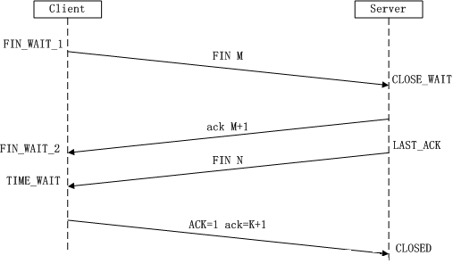
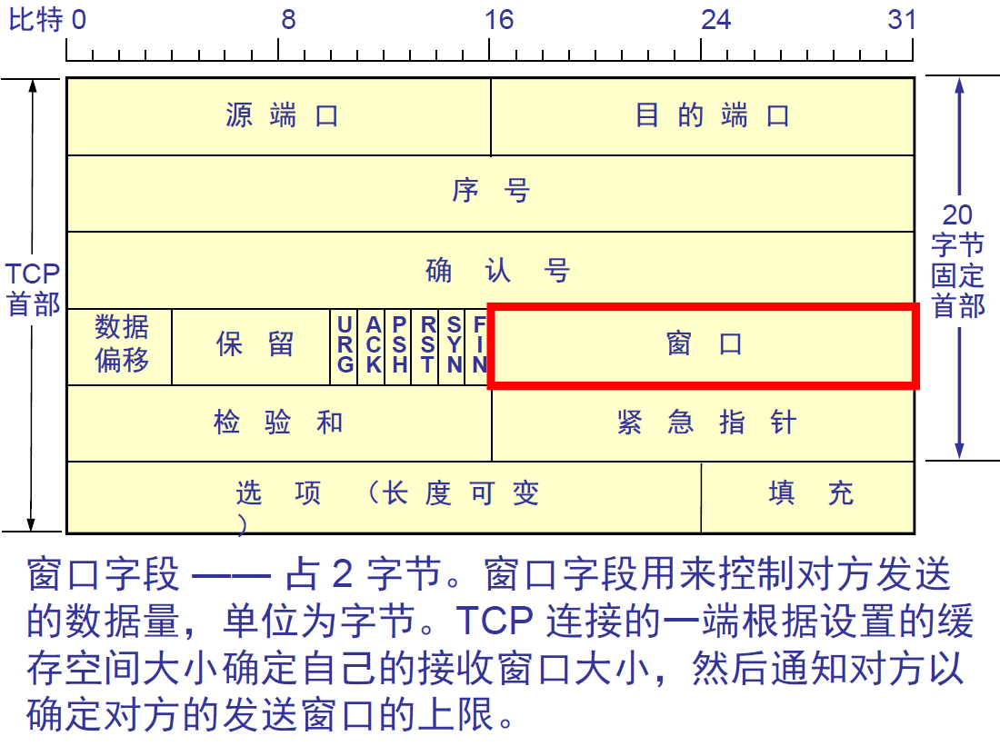
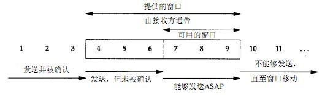
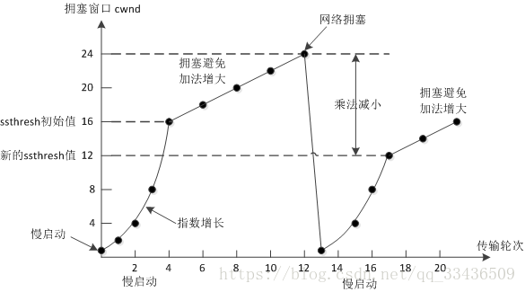
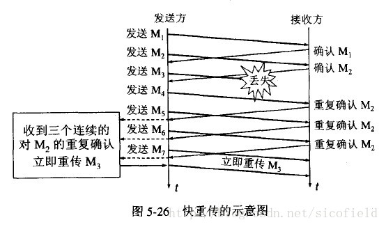
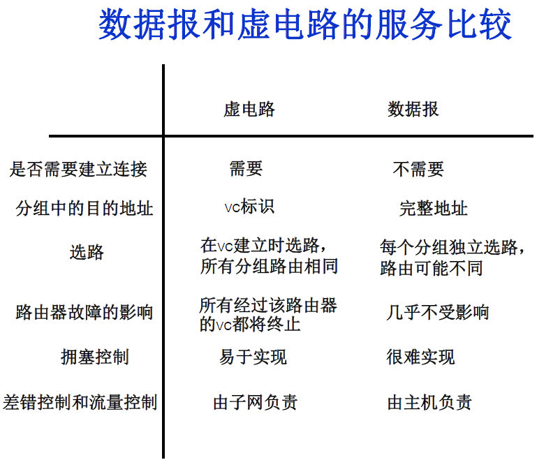
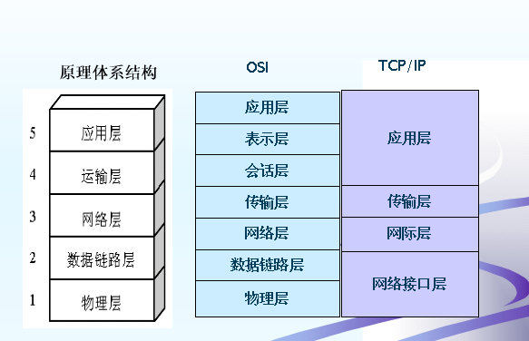
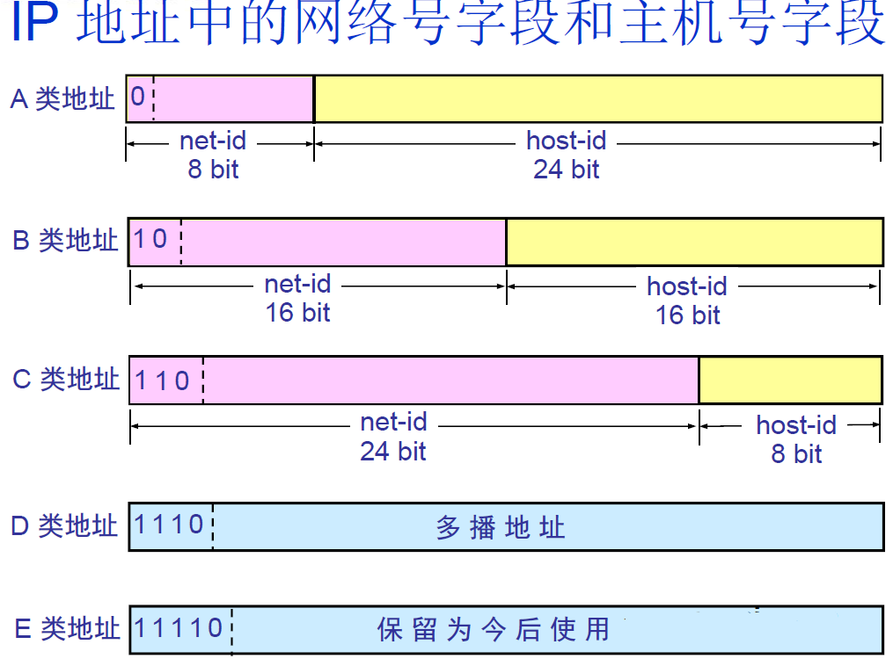

# 计算机网络

<!-- GFM-TOC -->
* 传输层：TCP和UDP
    * [什么是三次握手？](#什么是三次握手-three-way-handshake)
    * [什么是四次挥手？](#什么是四次挥手)
    * [TCP如何实现流量控制？](#TCP如何实现流量控制)
    * [TCP的拥塞控制是怎么实现的？](#TCP的拥塞控制是怎么实现的)
    * [TCP如何最大利用带宽？](#TCP如何最大利用带宽)
    * [TCP与UDP的区别](#TCP与UDP的区别)
    * [TCP如何保证传输的可靠性](#TCP如何保证传输的可靠性)
    * [~~什么是TCP粘包？~~](#什么是TCP粘包)
* 应用层：HTTP和HTTPS
    * [HTTP和HTTPS有什么区别？](#HTTP和HTTPS有什么区别)
    * [GET与POST的区别？](#GET与POST的区别)
    * [Session与Cookie的区别？](#Session与Cookie的区别)
    * [从输入网址到获得页面的过程 (越详细越好)？](#从输入网址到获得页面的过程-越详细越好)
    * [HTTP请求有哪些常见状态码？](#HTTP请求有哪些常见状态码)
    * [什么是RIP (距离矢量路由协议)?](#什么是RIP-Routing-Information-Protocol-距离矢量路由协议-算法是什么)
* [计算机网络体系结构](#计算机网络体系结构)
* 网络层协议
    * [IP地址的分类？](#IP地址的分类)
    * [什么叫划分子网？](#什么叫划分子网)
    * [什么是ARP协议？](#什么是ARP协议-Address-Resolution-Protocol)
    * [什么是NAT (网络地址转换)？](#什么是NAT-Network-Address-Translation-网络地址转换)
* [参考](#参考)
<!-- GFM-TOC -->

------

### 什么是三次握手 (three-way handshake)？

- 第一次握手：Client将SYN置1，随机产生一个初始序列号seq发送给Server，进入SYN_SENT状态；
- 第二次握手：Server收到Client的SYN=1之后，知道客户端请求建立连接，将自己的SYN置1，ACK置1，产生一个acknowledge number=sequence number+1，并随机产生一个自己的初始序列号，发送给客户端；进入SYN_RCVD状态；
- 第三次握手：客户端检查acknowledge number是否为序列号+1，ACK是否为1，检查正确之后将自己的ACK置为1，产生一个acknowledge number=服务器发的序列号+1，发送给服务器；进入ESTABLISHED状态；服务器检查ACK为1和acknowledge number为序列号+1之后，也进入ESTABLISHED状态；完成三次握手，连接建立。

##### TCP建立连接可以两次握手吗？为什么?

展开

不可以。有两个原因：

首先，可能会出现**已失效的连接请求报文段又传到了服务器端**。

> client 发出的第一个连接请求报文段并没有丢失，而是在某个网络结点长时间的滞留了，以致延误到连接释放以后的某个时间才到达 server。本来这是一个早已失效的报文段。但 server 收到此失效的连接请求报文段后，就误认为是 client 再次发出的一个新的连接请求。于是就向 client 发出确认报文段，同意建立连接。假设不采用 “三次握手”，那么只要 server 发出确认，新的连接就建立了。由于现在 client 并没有发出建立连接的请求，因此不会理睬 server 的确认，也不会向 server 发送数据。但 server 却以为新的运输连接已经建立，并一直等待 client 发来数据。这样，server 的很多资源就白白浪费掉了。采用 “三次握手” 的办法可以防止上述现象发生。例如刚才那种情况，client 不会向 server 的确认发出确认。server 由于收不到确认，就知道 client 并没有要求建立连接。

其次，两次握手无法保证Client正确接收第二次握手的报文（Server无法确认Client是否收到），也无法保证Client和Server之间成功互换初始序列号。

##### 可以采用四次握手吗？为什么？

展开

可以。但是会降低传输的效率。

四次握手是指：第二次握手：Server只发送ACK和acknowledge number；而Server的SYN和初始序列号在第三次握手时发送；原来协议中的第三次握手变为第四次握手。出于优化目的，四次握手中的二、三可以合并。

##### 第三次握手中，如果客户端的ACK未送达服务器，会怎样？

展开

Server端：  
由于Server没有收到ACK确认，因此会重发之前的SYN+ACK（默认重发五次，之后自动关闭连接进入CLOSED状态），Client收到后会重新传ACK给Server。

Client端，两种情况：  
1. 在Server进行超时重发的过程中，如果Client向服务器发送数据，数据头部的ACK是为1的，所以服务器收到数据之后会读取 ACK number，进入 establish 状态  
2. 在Server进入CLOSED状态之后，如果Client向服务器发送数据，服务器会以RST包应答。

##### 如果已经建立了连接，但客户端出现了故障怎么办？

展开

服务器每收到一次客户端的请求后都会重新复位一个计时器，时间通常是设置为2小时，若两小时还没有收到客户端的任何数据，服务器就会发送一个探测报文段，以后每隔75秒钟发送一次。若一连发送10个探测报文仍然没反应，服务器就认为客户端出了故障，接着就关闭连接。

##### 初始序列号是什么？

展开

TCP连接的一方A，随机选择一个32位的序列号（Sequence Number）作为发送数据的初始序列号（Initial Sequence Number，ISN），比如为1000，以该序列号为原点，对要传送的数据进行编号：1001、1002...三次握手时，把这个初始序列号传送给另一方B，以便在传输数据时，B可以确认什么样的数据编号是合法的；同时在进行数据传输时，A还可以确认B收到的每一个字节，如果A收到了B的确认编号（acknowledge number）是2001，就说明编号为1001-2000的数据已经被B成功接受。

### 什么是四次挥手？

- 第一次挥手：Client将FIN置为1，发送一个序列号seq给Server；进入FIN_WAIT_1状态；
- 第二次挥手：Server收到FIN之后，发送一个ACK=1，acknowledge number=收到的序列号+1；进入CLOSE_WAIT状态。此时客户端已经没有要发送的数据了，但仍可以接受服务器发来的数据。
- 第三次挥手：Server将FIN置1，发送一个序列号给Client；进入LAST_ACK状态；
- 第四次挥手：Client收到服务器的FIN后，进入TIME_WAIT状态；接着将ACK置1，发送一个acknowledge number=序列号+1给服务器；服务器收到后，确认acknowledge number后，变为CLOSED状态，不再向客户端发送数据。客户端等待2*MSL（报文段最长寿命）时间后，也进入CLOSED状态。完成四次挥手。

##### 为什么不能把服务器发送的ACK和FIN合并起来，变成三次挥手（CLOSE_WAIT状态意义是什么）？

展开

因为服务器收到客户端断开连接的请求时，可能还有一些数据没有发完，这时先回复ACK，表示接收到了断开连接的请求。等到数据发完之后再发FIN，断开服务器到客户端的数据传送。

##### 如果第二次挥手时服务器的ACK没有送达客户端，会怎样？

展开

客户端没有收到ACK确认，会重新发送FIN请求。

##### 客户端TIME_WAIT状态的意义是什么？

展开

第四次挥手时，客户端发送给服务器的ACK有可能丢失，TIME_WAIT状态就是用来重发可能丢失的ACK报文。如果Server没有收到ACK，就会重发FIN，如果Client在2*MSL的时间内收到了FIN，就会重新发送ACK并再次等待2MSL，防止Server没有收到ACK而不断重发FIN。

MSL(Maximum Segment Lifetime)，指一个片段在网络中最大的存活时间，2MSL就是一个发送和一个回复所需的最大时间。如果直到2MSL，Client都没有再次收到FIN，那么Client推断ACK已经被成功接收，则结束TCP连接。

### TCP如何实现流量控制？

使用滑动窗口协议实现流量控制。防止发送方发送速率太快，接收方缓存区不够导致溢出。接收方会维护一个接收窗口 receiver window（窗口大小单位是字节），接受窗口的大小是根据自己的资源情况动态调整的，在返回ACK时将接受窗口大小放在TCP报文中的窗口字段告知发送方。发送窗口的大小不能超过接受窗口的大小，只有当发送方发送并收到确认之后，才能将发送窗口右移。

发送窗口的上限为接受窗口和拥塞窗口中的较小值。接受窗口表明了接收方的接收能力，拥塞窗口表明了网络的传送能力。

##### 什么是零窗口（接收窗口为0时会怎样）？

展开

如果接收方没有能力接收数据，就会将接收窗口设置为0，这时发送方必须暂停发送数据，但是会启动一个持续计时器(persistence timer)，到期后发送一个大小为1字节的探测数据包，以查看接收窗口状态。如果接收方能够接收数据，就会在返回的报文中更新接收窗口大小，恢复数据传送。

### TCP的拥塞控制是怎么实现的？

拥塞控制主要由四个算法组成：**慢启动（Slow Start）、拥塞避免（Congestion voidance）、快重传 （Fast Retransmit）、快恢复（Fast Recovery）**

1. 慢启动：刚开始发送数据时，先把拥塞窗口（congestion window）设置为一个最大报文段MSS的数值，每收到一个新的确认报文之后，就把拥塞窗口加1个MSS。这样每经过一个传输轮次（或者说是每经过一个往返时间RTT），拥塞窗口的大小就会加倍

2. 拥塞避免：当拥塞窗口的大小达到慢开始门限(slow start threshold)时，开始执行拥塞避免算法，拥塞窗口大小不再指数增加，而是线性增加，即每经过一个传输轮次只增加1MSS.  
> 无论在慢开始阶段还是在拥塞避免阶段，只要发送方判断网络出现拥塞（其根据就是没有收到确认），就要把慢开始门限ssthresh设置为出现拥塞时的发送方窗口值的一半（但不能小于2）。然后把拥塞窗口cwnd重新设置为1，执行慢开始算法。**（这是不使用快重传的情况）**

3. 快重传：快重传要求接收方在收到一个失序的报文段后就立即发出**重复确认**（为的是使发送方及早知道有报文段没有到达对方）而不要等到自己发送数据时捎带确认。快重传算法规定，发送方只要一连收到三个重复确认就应当立即重传对方尚未收到的报文段，而不必继续等待设置的重传计时器时间到期。

4. 快恢复：当发送方连续收到三个重复确认时，就把慢开始门限减半，然后执行拥塞避免算法。不执行慢开始算法的原因：因为如果网络出现拥塞的话就不会收到好几个重复的确认，所以发送方认为现在网络可能没有出现拥塞。  
也有的快重传是把开始时的拥塞窗口cwnd值再增大一点，即等于 ssthresh + 3*MSS 。这样做的理由是：既然发送方收到三个重复的确认，就表明有三个分组已经离开了网络。这三个分组不再消耗网络的资源而是停留在接收方的缓存中。可见现在网络中减少了三个分组。因此可以适当把拥塞窗口扩大些。

### TCP如何最大利用带宽？

TCP速率受到三个因素影响

- 窗口：即滑动窗口大小，见[TCP如何实现流量控制？](#TCP如何实现流量控制)
- 带宽：这里带宽是指单位时间内从发送端到接收端所能通过的“最高数据率”，是一种硬件限制。TCP发送端和接收端的数据传输数不可能超过两点间的带宽限制。发送端和接收端之间带宽取所通过线路的带宽最小值（如通过互联网连接）。
- RTT：即Round Trip Time，表示从发送端到接收端的一去一回需要的时间，TCP在数据传输过程中会对RTT进行采样（即对发送的数据包及其ACK的时间差进行测量，并根据测量值更新RTT值），TCP根据得到的RTT值更新RTO值，即Retransmission TimeOut，就是重传间隔，发送端对每个发出的数据包进行计时，如果在RTO时间内没有收到所发出的数据包的对应ACK，则任务数据包丢失，将重传数据。一般RTO值都比采样得到的RTT值要大。

带宽时延乘积

带宽时延乘积=带宽*RTT，实际上等于发送端到接收端单向通道的数据容积的两倍，这里单向通道的数据容积可以这样来理解，单向通道看成是一条单行道马路，带宽就是马路的车道数，路上跑的汽车就是数据（不过这里所有汽车的速率都是一样的，且不会有人想超车，大家齐头并进），那么单向通道的数据容积就是这条单行道上摆满车，一共可以摆多少辆。带宽就是马路的车道数，带宽数乘以单向通道的数据容积就是路面上所能容纳的全部数据量。当路面上已经摆满的时候，就不能再往里面放了。

设滑动窗口大小为， 发送端和接收端的带宽为， RTT为。

前面已经说过了，TCP发送数据时受滑动窗口的限制，当TCP将滑动窗口中的数据都发出后，在收到第一个ACK之前，滑动窗口大小是0，不能再发送数据了，必须等待ACK包使滑动窗口移动。那么在理想情况下，ACK包应该在什么时候到达呢？显然，就是在数据发出后的RTT时间后，ACK包到达。这也就是说，现在在不考虑丢包和拥塞情况下，TCP在一个RTT时间内能发出的最大数据量为  ，所以不考虑带宽限制下，TCP能一个时刻能达到的最大速度是 。

现在再考虑带宽限制，前面说过当马路上摆满车的时候，就无法再往里放车了，同理，TCP发送端在  时间内，能往通道上放的最大数据量为  ，通过带宽时延乘积得到的容积限制为 。当  时，单向通道容积不构成瓶颈，速率的限制主要来源于窗口大小限制。而当  时，则就受到容积限制，即此时速率限制来源于带宽限制。

因此，TCP的最大速率为 })

在我们平时生活中使用的宽带网络，ADSL等环境下，因为带宽都比较小，从而  也比较小，再加上网络情况比较复杂，拥塞情况比较常见，所以这些网络环境下，TCP速率的主要限制因素在于带宽，丢包率等。长肥管道一般不太常见，多见于一些单位使用的专线网络，在这些网络中速率的主要限制因素就是窗口大小了，这也是传统TCP在这些网络环境中不能充分利用带宽的原因所在（因为传统TCP的窗口大小是用2字节表示的，所以最大只有65535（不考虑窗口扩大选项）），除了专线网络外，随着网络硬件技术的发展，万兆交换机的出现，局域网中也可能会出现带宽时延乘积较大的情况。

### TCP与UDP的区别

1. TCP是面向连接的，UDP是无连接的；

什么叫无连接？

UDP发送数据之前不需要建立连接

2. TCP是可靠的，UDP不可靠；

什么叫不可靠？

UDP接收方收到报文后，不需要给出任何确认

3. TCP只支持点对点通信，UDP支持一对一、一对多、多对一、多对多；
4. TCP是面向字节流的，UDP是面向报文的；

什么意思？

面向字节流是指发送数据时以字节为单位，一个数据包可以拆分成若干组进行发送，而UDP一个报文只能一次发完。

5. TCP有拥塞控制机制，UDP没有。网络出现的拥塞不会使源主机的发送速率降低，这对某些实时应用是很重要的，比如媒体通信，游戏；
6. TCP首部开销（20字节）比UDP首部开销（8字节）要大
7. UDP 的主机不需要维持复杂的连接状态表

##### 什么时候选择TCP，什么时候选UDP？

展开

对某些实时性要求比较高的情况，选择UDP，比如游戏，媒体通信，实时视频流（直播），即使出现传输错误也可以容忍；其它大部分情况下，HTTP都是用TCP，因为要求传输的内容可靠，不出现丢失

##### HTTP可以使用UDP吗？

展开

HTTP不可以使用UDP，HTTP需要基于可靠的传输协议，而UDP不可靠

注：**http 3.0 使用udp实现**
https://zh.wikipedia.org/wiki/HTTP/3

##### 面向连接和无连接的区别

展开

无连接的网络服务（数据报服务）-- 面向连接的网络服务（虚电路服务）

虚电路服务：首先建立连接，所有的数据包经过相同的路径，服务质量有较好的保证；

数据报服务：每个数据包含目的地址，数据路由相互独立（路径可能变化）；网络尽最大努力交付数据，但不保证不丢失、不保证先后顺序、不保证在时限内交付；网络发生拥塞时，可能会将一些分组丢弃；

### TCP如何保证传输的可靠性

1. 数据包校验
2. 对失序数据包重新排序（TCP报文具有序列号）
3. 丢弃重复数据
4. 应答机制：接收方收到数据之后，会发送一个确认（通常延迟几分之一秒）；
5. 超时重发：发送方发出数据之后，启动一个定时器，超时未收到接收方的确认，则重新发送这个数据；
6. 流量控制：确保接收端能够接收发送方的数据而不会缓冲区溢出

### HTTP和HTTPS有什么区别？

1. 端口不同：HTTP使用的是80端口，HTTPS使用443端口；
2. HTTP（超文本传输协议）信息是明文传输，HTTPS运行在SSL(Secure Socket Layer)之上，添加了加密和认证机制，更加安全；
3. HTTPS由于加密解密会带来更大的CPU和内存开销；
4. HTTPS通信需要证书，一般需要向证书颁发机构（CA）购买

##### Https的连接过程？

展开

1. 客户端向服务器发送请求，同时发送客户端支持的一套加密规则（包括对称加密、非对称加密、摘要算法）；
2. 服务器从中选出一组加密算法与HASH算法，并将自己的身份信息以证书的形式发回给浏览器。证书里面包含了网站地址，**加密公钥**（用于非对称加密），以及证书的颁发机构等信息（证书中的私钥只能用于服务器端进行解密）；
3. 客户端验证服务器的合法性，包括：证书是否过期，CA 是否可靠，发行者证书的公钥能否正确解开服务器证书的“发行者的数字签名”，服务器证书上的域名是否和服务器的实际域名相匹配；
4. 如果证书受信任，或者用户接收了不受信任的证书，浏览器会生成一个**随机密钥**（用于对称算法），并用服务器提供的公钥加密（采用非对称算法对密钥加密）；使用Hash算法对握手消息进行**摘要**计算，并对摘要使用之前产生的密钥加密（对称算法）；将加密后的随机密钥和摘要一起发送给服务器；
5. 服务器使用自己的私钥解密，得到对称加密的密钥，用这个密钥解密出Hash摘要值，并验证握手消息是否一致；如果一致，服务器使用对称加密的密钥加密握手消息发给浏览器；
6. 浏览器解密并验证摘要，若一致，则握手结束。之后的数据传送都使用对称加密的密钥进行加密

总结：非对称加密算法用于在握手过程中加密生成的密码；对称加密算法用于对真正传输的数据进行加密；HASH算法用于验证数据的完整性。

##### 输入 www.baidu.com，怎么变成 https://www.baidu.com 的，怎么确定用HTTP还是HTTPS？

展开

[你访问的网站是如何自动切换到 HTTPS 的？](https://www.sohu.com/a/136637876_487516)

一种是原始的302跳转，服务器把所有的HTTp流量跳转到HTTPS。但这样有一个漏洞，就是中间人可能在第一次访问站点的时候就劫持。
解决方法是引入HSTS机制，用户浏览器在访问站点的时候强制使用HTTPS。

##### HTTPS连接的时候，怎么确定收到的包是服务器发来的（中间人攻击）？

展开

##### 什么是对称加密、非对称加密？区别是什么？

展开

- 对称加密：加密和解密采用相同的密钥。如：DES、RC2、RC4
- 非对称加密：需要两个密钥：公钥和私钥。如果用公钥加密，需要用私钥才能解密。如：RSA
- 区别：对称加密速度更快，通常用于大量数据的加密；非对称加密安全性更高（不需要传送私钥）

##### 数字签名、报文摘要的原理

展开

- 发送者A用私钥进行签名，接收者B用公钥验证签名。因为除A外没有人有私钥，所以B相信签名是来自A。A不可抵赖，B也不能伪造报文。
- 摘要算法:MD5、SHA

### GET与POST的区别？

1. GET是幂等的，即读取同一个资源，总是得到相同的数据，POST不是幂等的；
2. GET一般用于从服务器获取资源，而POST有可能改变服务器上的资源；
3. 请求形式上：GET请求的数据附在URL之后，在HTTP请求头中；POST请求的数据在请求体中；
4. 安全性：GET请求可被缓存、收藏、保留到历史记录，且其请求数据明文出现在URL中。POST的参数不会被保存，安全性相对较高；
5. GET只允许ASCII字符，POST对数据类型没有要求，也允许二进制数据；
6. GET的长度有限制（操作系统或者浏览器），而POST数据大小无限制

### Session与Cookie的区别？

Session是服务器端保持状态的方案，Cookie是客户端保持状态的方案

Cookie保存在客户端本地，客户端请求服务器时会将Cookie一起提交；Session保存在服务端，通过检索Sessionid查看状态。保存Sessionid的方式可以采用Cookie，如果禁用了Cookie，可以使用URL重写机制（把会话ID保存在URL中）。

### 从输入网址到获得页面的过程 (越详细越好)？

1. 浏览器查询 DNS，获取域名对应的IP地址:具体过程包括浏览器搜索自身的DNS缓存、搜索操作系统的DNS缓存、读取本地的Host文件和向本地DNS服务器进行查询等。对于向本地DNS服务器进行查询，如果要查询的域名包含在本地配置区域资源中，则返回解析结果给客户机，完成域名解析(此解析具有权威性)；如果要查询的域名不由本地DNS服务器区域解析，但该服务器已缓存了此网址映射关系，则调用这个IP地址映射，完成域名解析（此解析不具有权威性）。如果本地域名服务器并未缓存该网址映射关系，那么将根据其设置发起递归查询或者迭代查询；
2. 浏览器获得域名对应的IP地址以后，浏览器向服务器请求建立链接，发起三次握手；
3. TCP/IP链接建立起来后，浏览器向服务器发送HTTP请求；
4. 服务器接收到这个请求，并根据路径参数映射到特定的请求处理器进行处理，并将处理结果及相应的视图返回给浏览器；
5. 浏览器解析并渲染视图，若遇到对js文件、css文件及图片等静态资源的引用，则重复上述步骤并向服务器请求这些资源；
6. 浏览器根据其请求到的资源、数据渲染页面，最终向用户呈现一个完整的页面。

### HTTP请求有哪些常见状态码？

1. 2xx状态码：操作成功。200 OK
2. 3xx状态码：重定向。301 永久重定向；302暂时重定向
3. 4xx状态码：客户端错误。400 Bad Request；401 Unauthorized；403 Forbidden；404 Not Found；
4. 5xx状态码：服务端错误。500服务器内部错误；501服务不可用

### 什么是RIP (Routing Information Protocol, 距离矢量路由协议)? 算法是什么？
每个路由器维护一张表，记录该路由器到其它网络的”跳数“，路由器到与其直接连接的网络的跳数是1，每多经过一个路由器跳数就加1；更新该表时和相邻路由器交换路由信息；路由器允许一个路径最多包含15个路由器，如果跳数为16，则不可达。交付数据报时优先选取距离最短的路径。

（PS：RIP是应用层协议：[https://www.zhihu.com/question/19645407](https://www.zhihu.com/question/19645407)）

优缺点

- 实现简单，开销小
- 随着网络规模扩大开销也会增大；
- 最大距离为15，限制了网络的规模；
- 当网络出现故障时，要经过较长的时间才能将此信息传递到所有路由器

### 计算机网络体系结构

- Physical, Data Link, Network, Transport, Application
- 应用层：常见协议：
    - FTP(21端口)：文件传输协议
    - SSH(22端口)：远程登陆
    - TELNET(23端口)：远程登录
    - SMTP(25端口)：发送邮件
    - POP3(110端口)：接收邮件
    - HTTP(80端口)：超文本传输协议
    - DNS(53端口)：运行在UDP上，域名解析服务
- 传输层：TCP/UDP
- 网络层：IP、ARP、NAT、RIP...

路由器、交换机位于哪一层？

- 路由器网络层，根据IP地址进行寻址；
- 交换机数据链路层，根据MAC地址进行寻址

### IP地址的分类？

路由器仅根据网络号net-id来转发分组，当分组到达目的网络的路由器之后，再按照主机号host-id将分组交付给主机；同一网络上的所有主机的网络号相同。

### 什么叫划分子网？

从主机号host-id借用若干个比特作为子网号subnet-id；子网掩码：网络号和子网号都为1，主机号为0；数据报仍然先按照网络号找到目的网络，发送到路由器，路由器再按照网络号和子网号找到目的子网：将子网掩码与目标地址逐比特与操作，若结果为某个子网的网络地址，则送到该子网。

### 什么是ARP协议 (Address Resolution Protocol)？

**ARP协议完成了IP地址与物理地址的映射**。每一个主机都设有一个 ARP 高速缓存，里面有**所在的局域网**上的各主机和路由器的 IP 地址到硬件地址的映射表。当源主机要发送数据包到目的主机时，会先检查自己的ARP高速缓存中有没有目的主机的MAC地址，如果有，就直接将数据包发到这个MAC地址，如果没有，就向**所在的局域网**发起一个ARP请求的广播包（在发送自己的 ARP 请求时，同时会带上自己的 IP 地址到硬件地址的映射），收到请求的主机检查自己的IP地址和目的主机的IP地址是否一致，如果一致，则先保存源主机的映射到自己的ARP缓存，然后给源主机发送一个ARP响应数据包。源主机收到响应数据包之后，先添加目的主机的IP地址与MAC地址的映射，再进行数据传送。如果源主机一直没有收到响应，表示ARP查询失败。

如果所要找的主机和源主机不在同一个局域网上，那么就要通过 ARP 找到一个位于本局域网上的某个路由器的硬件地址，然后把分组发送给这个路由器，让这个路由器把分组转发给下一个网络。剩下的工作就由下一个网络来做。

### 什么是NAT (Network Address Translation, 网络地址转换)？

用于解决内网中的主机要和因特网上的主机通信。由NAT路由器将主机的本地IP地址转换为全球IP地址，分为静态转换（转换得到的全球IP地址固定不变）和动态NAT转换。

### 参考
- [面试/笔试第一弹 —— 计算机网络面试问题集锦](https://blog.csdn.net/justloveyou_/article/details/78303617)
- [什么时候选TCP、UDP？](https://blog.csdn.net/yjxsdzx/article/details/71937886)
- [TCP速率与窗口，带宽，RTT之间的关系](https://blog.csdn.net/bad_sheep/article/details/6158676)
