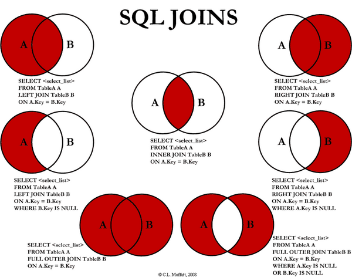

# 数据库

* 数据库基础
    * [事务的概念和特性？](#事务的概念和特性)
    * [会出现哪些并发一致性问题？](#会出现哪些并发一致性问题)
    * [数据库的四种隔离级别？](#数据库的四种隔离级别)
    * [什么是乐观锁和悲观锁？](#什么是乐观锁和悲观锁)
    * [常见的封锁类型？](#常见的封锁类型)
    * [什么是三级封锁协议？](#什么是三级封锁协议)
    * [什么是两段锁协议？](#什么是两段锁协议)
    * [什么是 MVCC？](#什么是-mvcc)
    * [数据库的范式？](#数据库的范式)
    * [列举几种表连接方式？](#列举几种表连接方式)
    * [什么是存储过程？有哪些优缺点？](#什么是存储过程有哪些优缺点)
    * [Drop/Delete/Truncate的区别？](#DropDeleteTruncate的区别)
    * [什么是视图？什么是游标？](#什么是视图什么是游标)
* MySQL
    * [数据库索引的实现原理（B+树）](#数据库索引的实现原理b树)
    * [使用索引的优点](#使用索引的优点)
    * [哪些情况下索引会失效？](#哪些情况下索引会失效)
    * [在哪些地方适合创建索引？](#在哪些地方适合创建索引)
    * [索引的分类？](#索引的分类)
    * [MySQL的两种存储引擎 InnoDB 和 MyISAM 的区别？](#MySQL的两种存储引擎-InnoDB-和-MyISAM-的区别)
    * [如何优化数据库？](#如何优化数据库)
    * [什么是主从复制？实现原理是什么？](#什么是主从复制实现原理是什么)
* NoSQL/Redis
    * [关系型数据库和非关系型数据库的区别？](关系型数据库和非关系型数据库的区别)
* [参考](#参考)

------

### 事务的概念和特性？
概念：事务（Transaction）是一个操作序列，不可分割的工作单位，以BEGIN TRANSACTION开始，以ROLLBACK/COMMIT结束

特性（ACID）：
- **原子性**（Atomicity）：逻辑上是不可分割的操作单元，事务的所有操作要么全部提交成功，要么全部失败回滚（用回滚日志实现，反向执行日志中的操作）；
- **一致性**（Consistency）：事务的执行必须使数据库保持一致性状态。在一致性状态下，所有事务对一个数据的读取结果都是相同的；
- **隔离性**（Isolation）：一个事务所做的修改在最终提交以前，对其它事务是不可见的（并发执行的事务之间不能相互影响）；
- **持久性**（Durability）：一旦事务提交成功，对数据的修改是永久性的

### 会出现哪些并发一致性问题？
- **丢失修改**：一个事务对数据进行了修改，在事务提交之前，另一个事务对同一个数据进行了修改，覆盖了之前的修改；
- **脏读**（Dirty Read）：一个事务读取了被另一个事务修改、但未提交（进行了回滚）的数据，造成两个事务得到的数据不一致；
- **不可重复读**（Nonrepeatable Read）：在同一个事务中，某查询操作在一个时间读取某一行数据和之后一个时间读取该行数据，发现数据已经发生修改（可能被更新或删除了）；
- **幻读**（Phantom Read）：当同一查询多次执行时，由于其它事务在这个数据范围内执行了**插入操作**，会导致每次返回不同的结果集（和不可重复读的区别：针对的是一个数据整体/范围；并且需要是插入操作）

### 数据库的四种隔离级别？

- **未提交读**（Read Uncommited）：在一个事务提交之前，它的执行结果对其它事务也是可见的。会导致脏读、不可重复读、幻读；
- **提交读**（Read Commited）：一个事务只能看见已经提交的事务所作的改变。可避免脏读问题；
- **可重复读**（Repeatable Read）：可以确保同一个事务在多次读取同样的数据时得到相同的结果。（MySQL的默认隔离级别）。可避免不可重复读；
- **可串行化**（Serializable）：强制事务串行执行，使之不可能相互冲突，从而解决幻读问题。可能导致大量的超时现象和锁竞争，实际很少使用。

### 什么是乐观锁和悲观锁？

- 悲观锁：认为数据随时会被修改，因此每次读取数据之前都会上锁，防止其它事务读取或修改数据；应用于**数据更新比较频繁**的场景；
- 乐观锁：操作数据时不会上锁，但是更新时会判断在此期间有没有别的事务更新这个数据，若被更新过，则失败重试；适用于**读多写少**的场景。乐观锁的实现方式有：
    - 加一个版本号或者时间戳字段，每次数据更新时同时更新这个字段；
    - 先读取想要更新的字段或者所有字段，更新的时候比较一下，只有字段没有变化才进行更新

### 常见的封锁类型？
意向锁是 InnoDB 自动加的， 不需用户干预。 
对于 UPDATE、 DELETE 和 INSERT 语句， InnoDB
会自动给涉及数据集加排他锁（X)；
对于普通 SELECT 语句，InnoDB 不会加任何锁；
事务可以通过以下语句显式给记录集加共享锁或排他锁：
共享锁（S）：SELECT * FROM table_name WHERE ... LOCK IN SHARE MODE。 其他 session 仍然可以查询记录，并也可以对该记录加 share mode 的共享锁。但是如果当前事务需要对该记录进行更新操作，则很有可能造成死锁。
排他锁（X)：SELECT * FROM table_name WHERE ... FOR UPDATE。其他 session 可以查询该记录，但是不能对该记录加共享锁或排他锁，而是等待获得锁
- **排它锁**（Exclusive Lock）/ X锁：事务对数据加上X锁时，只允许此事务读取和修改此数据，并且其它事务不能对该数据加任何锁；
- **共享锁**（Shared Lock）/ S锁：加了S锁后，该事务只能对数据进行读取而不能修改，并且其它事务只能加S锁，不能加X锁
- **意向锁**（Intention Locks）：
    - 一个事务在获得某个**数据行**对象的 S 锁之前，必须先获得**整个表**的 IS 锁或更强的锁；
    - 一个事务在获得某个数据行对象的 X 锁之前，必须先获得整个表的 IX 锁；
    - IS/IX 锁之间都是兼容的；
    - 好处：如果一个事务想要对整个表加X锁，就需要先检测是否有其它事务对该表或者该表中的某一行加了锁，这种检测非常耗时。有了意向锁之后，只需要检测整个表是否存在IX/IS/X/S锁就行了

锁的作用：用于管理对共享资源的并发访问，保证数据库的完整性和一致性
<details>
<summary>封锁粒度的概念</summary>

MySQL 中提供了两种封锁粒度：**行级锁**以及**表级锁**。

封锁粒度小：

- 好处：锁定的数据量越少，发生锁争用的可能就越小，系统的**并发程度**就越高；
- 坏处：**系统开销**大（加锁、释放锁、检查锁的状态都需要消耗资源）
</details>

<details>
<summary>MySQL加锁</summary>

```
SELECT ... LOCK In SHARE MODE;
SELECT ... FOR UPDATE;
```
</details>

### 什么是三级封锁协议？
- 一级封锁协议：事务在修改数据之前必须先对其加X锁，直到事务结束才释放。可以解决丢失修改问题（两个事务不能同时对一个数据加X锁，避免了修改被覆盖）；
- 二级封锁协议：在一级的基础上，事务在读取数据之前必须先加S锁，读完后释放。可以解决脏读问题（如果已经有事务在修改数据，就意味着已经加了X锁，此时想要读取数据的事务并不能加S锁，也就无法进行读取，避免了读取脏数据）；
- 三级封锁协议：在二级的基础上，事务在读取数据之前必须先加S锁，直到事务结束才能释放。可以解决不可重复读问题（避免了在事务结束前其它事务对数据加X锁进行修改，保证了事务期间数据不会被其它事务更新）

### 什么是两段锁协议？
事务必须严格分为两个阶段对数据进行**加锁和解锁**的操作，第一阶段加锁，第二阶段解锁。也就是说一个事务中一旦释放了锁，就不能再申请新锁了。

**可串行化调度**是指，通过并发控制，使得并发执行的事务结果与某个串行执行的事务结果相同。事务遵循两段锁协议是保证可串行化调度的充分条件。

### 什么是 MVCC？
多版本并发控制（Multi-Version Concurrency Control, MVCC），MVCC在每行记录后面都保存有两个隐藏的列，用来存储**创建版本号**和**删除版本号**。

- 创建版本号：创建一个数据行时的事务版本号（**事务版本号**：事务开始时的系统版本号；系统版本号：每开始一个新的事务，系统版本号就会自动递增）；
- 删除版本号：删除操作时的事务版本号；
- 各种操作：
    - 插入操作时，记录创建版本号；
    - 删除操作时，记录删除版本号；
    - 更新操作时，先记录删除版本号，再新增一行记录创建版本号；
    - 查询操作时，要符合以下条件才能被查询出来：删除版本号未定义或大于当前事务版本号（删除操作是在当前事务启动之后做的）；创建版本号小于或等于当前事务版本号（创建操作是事务完成或者在事务启动之前完成）

通过版本号减少了锁的争用，**提高了系统性能**；可以实现**提交读**和**可重复读**两种隔离级别，未提交读无需使用MVCC

<details>
<summary>快照读与当前读</summary>

使用 MVCC 读取的是快照中的数据，这样可以减少加锁所带来的开销：

```
select * from table ...;
```

当前读读取的是最新的数据，需要加锁。以下第一个语句需要加 S 锁，其它都需要加 X 锁：

```
select * from table where ? lock in share mode;
select * from table where ? for update;
insert;
update;
delete;
```

</details>

### 数据库的范式？

- **第一范式**（1NF，Normal Form）：**属性不应该是可分的**。举例：如果将“电话”作为一个属性（一列），是不符合1NF的，因为电话这个属性可以分解为家庭电话和移动电话...如果将“移动电话”作为一个属性，就符合1NF；
- **第二范式** 2NF：每个非主属性**完全依赖**于主属性集（候选键集）；
    - B完全依赖于A，就是说A中的所有属性唯一决定B，属性少了就不能唯一决定，属性多了则有冗余（叫依赖不叫完全依赖）。举例：（学号，课程名）这个主属性集可以唯一决定成绩，但是对于学生姓名这个属性，（学号，课程名）这个属性集就是冗余的，所以学生姓名不完全依赖于（学号，课程名）这一属性集；
    - 主属性集/候选码集：某一组属性能够唯一确定其它的属性（主键就是从候选键集中选的一个键），而其子集不能，这样的属性组中的属性就是主属性；不在候选码集中的属性成为非主属性；
    - 可以通过分解来满足 2NF：将（学号，课程名，成绩）做成一张表；（学号，学生姓名）做成另一张表，避免大量的数据冗余；
    满足1NF后，要求表中的所有列，都必须依赖于主键，而不能有任何一列与主键没有关系，也就是说一个表只描述一件事情；
- **第三范式** 3NF：在 2NF 的基础上，非主属性**不传递依赖**于主属性
    - 传递依赖：如果C依赖于B，B依赖于A，那么C传递依赖于A；
    - 3NF在2NF的基础上，消除了非主属性之间的依赖；比如一个表中，主属性有（学号），非主属性有（姓名，院系，院长名），可以看到院长名这个非主属性依赖于院系，传递依赖于学号。消除的办法是分解。
必须先满足第二范式（2NF），要求：表中的每一列只与主键直接相关而不是间接相关，（表中的每一列只能依赖于主键）；
<details>
<summary>不符合范式会出现哪些异常？</summary>

- 冗余数据：某些同样的数据多次出现（如学生姓名）；
- 修改异常：修改了一个记录中的信息，另一个记录中相同的信息却没有修改；
- 删除异常：删除一个信息，那么也会丢失其它信息（删除一个课程，丢失了一个学生的信息）；
- 插入异常：无法插入（插入一个还没有课程信息的学生）
</details>

### 列举几种表连接方式？



- 内连接（Inner Join）：仅将两个表中满足连接条件的行组合起来作为结果集
    - 自然连接：只考虑属性相同的元组对；
    - 等值连接：给定条件进行查询
- 外连接（Outer Join）
    - 左连接：左边表的所有数据都有显示出来，右边的表数据只显示共同有的那部分，没有对应的部分补NULL；
    - 右连接：和左连接相反；
    - 全外连接（Full Outer Join）：查询出左表和右表所有数据，但是去除两表的重复数据
- 交叉连接（Cross Join）：返回两表的笛卡尔积（对于所含数据分别为m、n的表，返回m*n的结果）

### 什么是存储过程？有哪些优缺点？
存储过程是事先经过编译并存储在数据库中的一段SQL语句的集合。想要实现相应的功能时，只需要调用这个存储过程就行了（类似于函数，输入具有输出参数）。

优点：
- 预先编译，而不需要每次运行时编译，提高了数据库执行**效率**；
- 封装了一系列操作，对于一些数据交互比较多的操作，相比于单独执行SQL语句，可以**减少网络通信量**；
- 具有**可复用性**，减少了数据库开发的工作量；
- **安全性高**，可以让没有权限的用户通过存储过程间接操作数据库；
- 更**易于维护**

缺点：
- **可移植性差**，存储过程将应用程序绑定到了数据库上；
- **开发调试复杂**：没有好的IDE；
- **修改复杂**，需要重新编译，有时还需要更新程序中的代码以更新调用

### Drop/Delete/Truncate的区别？
- **Delete**用来删除表的全部或者**部分数据**，执行delete之后，用户**需要提交**之后才会执行，会触发表上的DELETE**触发器**（包含一个OLD的虚拟表，可以只读访问被删除的数据），DELETE之后表结构还在，删除很慢，一行一行地删，因为会记录日志，可以利用日志还原数据；
- **Truncate**删除表中的所有数据，这个操作**不能回滚**，也不会触发这个表上的触发器。操作比DELETE快很多（直接把表drop掉，再创建一个新表，删除的数据不能找回）。如果表中有自增（AUTO_INCREMENT）列，则重置为1；
- **Drop**命令从数据库中**删除表**，所有的数据行，索引和约束都会被删除；不能回滚，不会触发触发器；

<details>
<summary>什么是触发器？</summary>

触发器（TRIGGER）是由事件（比如INSERT/UPDATE/DELETE）来触发运行的操作（不能被直接调用，不能接收参数）。在数据库里以独立的对象存储，用于**保证数据完整性**（比如可以检验或转换数据）。
</details>

<details>
<summary>有哪些约束类型？</summary>

约束（Constraint）类型：主键（Primary Key）约束，唯一约束（Unique），检查约束，非空约束，外键（Foreign Key）约束。
</details>

### 什么是视图？什么是游标？
- 视图：从数据库的基本表中通过查询选取出来的数据组成的**虚拟表**（数据库中存放视图的定义）。可以对其进行增/删/改/查等操作。视图是对若干张基本表的引用，一张虚表，查询语句执行的结果，不存储具体的数据（基本表数据发生了改变，视图也会跟着改变）；可以跟基本表一样，进行增删改查操作(ps:增删改操作有条件限制)；如连表查询产生的视图无法进行，对视图的增删改会影响原表的数据。好处：
    - 通过只给用户访问视图的权限，保证数据的**安全性**；
    - **简化**复杂的SQL操作，隐藏数据的复杂性（比如复杂的连接）；
- 游标（Cursor）：用于定位在查询返回的**结果集的特定行**，以对特定行进行操作。使用游标可以方便地对结果集进行移动遍历，根据需要滚动或对浏览/修改任意行中的数据。主要用于交互式应用。

------

### 数据库索引的实现原理（B+树）

见[数据结构部分：B树，B+树](https://github.com/wolverinn/Iridescent/blob/master/Data%20Structure.md#b%E6%A0%91)

##### 使用B树和B+树的比较

InnoDB的索引使用的是B+树实现，B+树对比B树的好处：

- IO次数少：B+树的中间结点只存放索引，数据都存在叶结点中，因此中间结点可以存更多的数据，让索引树更加矮胖；
- 范围查询效率更高：B树需要中序遍历整个树，只B+树需要遍历叶结点中的链表；
- 查询效率更加稳定：每次查询都需要从根结点到叶结点，路径长度相同，所以每次查询的效率都差不多

##### 使用B树索引和哈希索引的比较

哈希索引能以 O(1) 时间进行查找，但是只支持精确查找，无法用于部分查找和范围查找，无法用于排序与分组；B树索引支持大于小于等于查找，范围查找。哈希索引遇到大量哈希值相等的情况后查找效率会降低。哈希索引不支持数据的排序。

### 使用索引的优点
- 大大加快了数据的**检索速度**；
- 可以显著减少查询中**分组和排序**的时间；
- 通过创建唯一性索引，可以保证数据库表中每一行数据的唯一性；
- 将随机 I/O 变为**顺序 I/O**（B+Tree 索引是有序的，会将相邻的数据都存储在一起）

缺点：建立和维护索引耗费时间空间，更新索引很慢。

### 哪些情况下索引会失效？
- 以“%(表示任意0个或多个字符)”开头的LIKE语句；
- OR语句前后没有同时使用索引；
- 数据类型出现隐式转化（如varchar不加单引号的话可能会自动转换为int型）；
- 对于多列索引，必须满足 **最左匹配原则**/最左前缀原则 (最左优先，eg：多列索引col1、col2和col3，则 索引生效的情形包括 col1或col1，col2或col1，col2，col3)；
- 如果MySQL估计全表扫描比索引快，则不使用索引（比如非常小的表）

### 在哪些地方适合创建索引？
- 某列经常作为最大最小值；
- 经常被查询的字段；
- 经常用作表连接的字段；
- 经常出现在ORDER BY/GROUP BY/DISDINCT后面的字段

##### 创建索引时需要注意什么？
<details>
<summary>展开</summary>

- 只应建立在**小字段**上，而不要对大文本或图片建立索引（一页存储的数据越多一次IO操作获取的数据越大效率越高）；
- 建立索引的字段应该**非空**，在MySQL中，含有空值的列很难进行查询优化，因为它们使得索引、索引的统计信息以及比较运算更加复杂。应该用0、一个特殊的值或者一个空串代替NULL；
- 选择**数据密度大**（唯一值占总数的百分比很大）的字段作索引
</details>

### 索引的分类？
- 普通索引
- 唯一索引 UNIQUE：索引列的值必须唯一，但允许有空值；
- 主键索引 PRIMARY KEY：必须唯一，不允许空值（是一种特殊的唯一索引；MySQL创建主键时默认为聚集索引，但主键也可以是非聚集索引）；
- 单列索引和多列索引/复合索引（Composite）：索引的列数；
- 覆盖（Covering）索引：索引包含了所有满足查询所需要的数据，查询的时候只需要读取索引而不需要回表读取数据；
- 聚集（Clustered）索引/非聚集索引：对磁盘上存放数据的物理地址重新组织以使这些数据按照指定规则排序的一种索引（数据的物理排列顺序和索引排列顺序一致）。因此每张表只能创建一个聚集索引（因为要改变物理存储顺序）。优点是查询速度快，因为可以直接按照顺序得到需要数据的物理地址。缺点是进行修改的速度较慢。对于需要经常搜索范围的值很有效。非聚集索引只记录逻辑顺序，并不改变物理顺序；
- 分区索引（？）
- 虚拟索引（Virtual）：模拟索引的存在而不用真正创建一个索引，用于快速测试创建索引对执行计划的影响。没有相关的索引段，不增加存储空间的使用

### MySQL的两种存储引擎 InnoDB 和 MyISAM 的区别？
- InnoDB**支持事务**，可以进行Commit和Rollback；
- MyISAM 只支持表级锁，而 InnoDB 还**支持行级锁**，提高了并发操作的性能；
- InnoDB **支持外键**；
- MyISAM **崩溃**后发生损坏的概率比 InnoDB 高很多，而且**恢复的速度**也更慢；
- MyISAM 支持**压缩**表和空间数据索引，InnoDB需要更多的内存和存储；
- InnoDB 支持在线**热备份**

<details>
<summary>应用场景</summary>

- **MyISAM** 管理非事务表。它提供高速存储和检索（MyISAM强调的是性能，每次查询具有原子性，其执行速度比InnoDB更快），以及全文搜索能力。如果表比较小，或者是只读数据（有大量的SELECT），还是可以使用MyISAM；
- **InnoDB** 支持事务，并发情况下有很好的性能，基本可以替代MyISAM
</details>

<details>
<summary>热备份和冷备份</summary>

- 热备份：在数据库运行的情况下备份的方法。优点：可按表或用户备份，备份时数据库仍可使用，可恢复至任一时间点。但是不能出错
- 冷备份：数据库正常关闭后，将关键性文件复制到另一位置的备份方式。优点：操作简单快速，恢复简单
</details>

### 如何优化数据库？
<details>
<summary>SQL 语句的优化</summary>

> 分析慢查询日志：记录了在MySQL中响应时间超过阀值long_query_time的SQL语句，通过日志去找出IO大的SQL以及发现未命中索引的SQL

> 使用 Explain 进行分析：通过explain命令可以得到表的读取顺序、数据读取操作的操作类型、哪些索引可以使用、**哪些索引被实际使用**、表之间的引用以及**被扫描的行数**等问题；

- 应尽量避免在 where 子句中使用```!=```、```<```、```>```操作符或对字段进行null值判断，否则将引擎放弃使用索引而进行全表扫描；
- 只返回必要的列：最好不要使用 SELECT * 语句；
- 只返回必要的行：使用 LIMIT 语句来限制返回的数据；
- 将一个大连接查询分解成对每一个表进行一次单表查询，然后在应用程序中进行关联，这样做的好处有：
    - 让缓存更高效。对于连接查询，如果其中一个表发生变化，那么整个查询缓存就无法使用。而分解后的多个查询，即使其中一个表发生变化，对其它表的查询缓存依然可以使用；
    - 分解成多个单表查询，这些单表查询的缓存结果更可能被其它查询使用到，从而减少冗余的查询；
    - 减少锁竞争
</details>

<details>
<summary>索引的优化</summary>

注意会引起索引失效的情况，以及在适合的地方建立索引
</details>

<details>
<summary>数据库表结构的优化</summary>

- 设计表时遵循**三大范式**；
- 选择合适的**数据类型**：尽可能不要存储NULL字段；使用简单的数据类型（int, varchar/ text）；
- 表的**水平切分**（Sharding）：将同一个表中的记录拆分到多个结构相同的表中（策略：哈希取模；根据ID范围来分）。当一个表的数据不断增多时，Sharding 是必然的选择，它可以将数据分布到集群的不同节点上，从而缓解单个数据库的压力；
- 表的**垂直切分**：将一张表按列切分成多个表。可以将不常用的字段单独放在同一个表中；把大字段独立放入一个表中；或者把经常使用的字段（关系密切的）放在一张表中。垂直切分之后业务更加清晰，系统之间整合或扩展容易，数据维护简单
</details>

<details>
<summary>系统配置的优化</summary>

- 操作系统：增加TCP支持的队列数；
- MySQL配置文件优化：缓存池大小和个数设置
</details>

<details>
<summary>硬件的优化</summary>

- 磁盘性能：固态硬盘；
- CPU：多核且高频；
- 内存：增大内存
</details>

### 什么是主从复制？实现原理是什么？
主从复制（Replication）是指数据可以从一个MySQL数据库主服务器复制到一个或多个从服务器，从服务器可以复制主服务器中的所有数据库或者特定的数据库，或者特定的表。默认采用异步模式。

实现原理：
- 主服务器 **binary log dump 线程**：将主服务器中的数据更改（增删改）日志写入 Binary log 中；
- 从服务器 **I/O 线程**：负责从主服务器读取binary log，并写入本地的 Relay log；
- 从服务器 **SQL 线程**：负责读取 Relay log，解析出主服务器已经执行的数据更改，并在从服务器中重新执行（Replay），保证主从数据的一致性

##### 为什么要主从复制？
<details>
<summary>展开</summary>

- 读写分离：主服务器负责写，从服务器负责读
    - 缓解了锁的争用，即使主服务器中加了锁，依然可以进行读操作；
    - 从服务器可以使用 MyISAM，提升查询性能以及节约系统开销；
    - 增加冗余，提高可用性
- 数据实时备份，当系统中某个节点发生故障时，可以方便的故障切换
- 降低单个服务器磁盘I/O访问的频率，提高单个机器的I/O性能
</details>

### 关系型数据库和非关系型数据库的区别？


### 参考

- [数据库六大范式详解 -- CSDN博客](https://blog.csdn.net/weixin_43433032/article/details/89293663)
- [delete，truncate 和 delete之间的区别 -- 博客园](https://www.cnblogs.com/alice-cj/p/10354737.html)
- [深度探索MySQL主从复制原理](https://baijiahao.baidu.com/s?id=1617888740370098866&wfr=spider&for=pc)
- 数据库程序员面试笔试宝典-机械工业出版社
- [CS-Notes/数据库系统原理 -- GitHub](https://github.com/CyC2018/CS-Notes/blob/master/notes/%E6%95%B0%E6%8D%AE%E5%BA%93%E7%B3%BB%E7%BB%9F%E5%8E%9F%E7%90%86.md)
- [面试/笔试第三弹 —— 数据库面试问题集锦 -- CSDN博客](https://blog.csdn.net/justloveyou_/article/details/78308460)
- [史上最全的数据库面试题，不看绝对后悔 -- 博客园](https://www.cnblogs.com/wenxiaofei/p/9853682.html)

### 待完成
- [ ] E-R 模型
- [ ] 数据库的三级模式和二级映像
- [ ] [数据类型](https://github.com/CyC2018/CS-Notes/blob/master/notes/MySQL.md#%E5%9B%9B%E6%95%B0%E6%8D%AE%E7%B1%BB%E5%9E%8B)：VARCHAR和CHAR的区别，DATETIME和TIMESATMP的区别
- [ ] Redis 面试
    - [CyC2018](https://github.com/CyC2018/CS-Notes/blob/master/notes/Redis.md)
    - [几率大的Redis面试题（含答案） - CSDN](https://blog.csdn.net/Butterfly_resting/article/details/89668661)
    - [Redis面试题总结 - 简书](https://www.jianshu.com/p/65765dd10671)
    - [Redis常见面试题 - 博客园](https://www.cnblogs.com/jasontec/p/9699242.html)
    - [0voice/interview_internal_reference](https://github.com/0voice/interview_internal_reference#10)
- [ ] [史上最全的数据库面试题，不看绝对后悔 -- 博客园](https://www.cnblogs.com/wenxiaofei/p/9853682.html)
