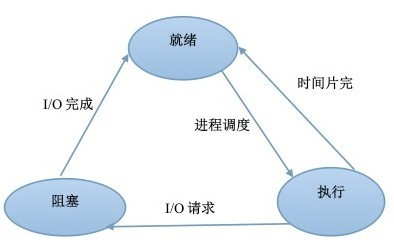

# 操作系统

* 进程和线程
    * [进程和线程有什么区别？](#进程和线程有什么区别)
    * [进程间通信有哪些方式？](#进程间通信有哪些方式)
    * [进程同步问题](#进程同步问题)
    * [进程有哪几种状态？](#进程有哪几种状态)
    * [进程调度策略有哪些？](#进程调度策略有哪些)
    * [什么是僵尸进程？](#什么是僵尸进程)
    * [线程同步有哪些方式？](#线程同步有哪些方式)
    * [什么是协程？](#什么是协程)
    * [什么是IO多路复用？怎么实现？](#什么是IO多路复用怎么实现)
    * [什么是用户态和内核态？](#什么是用户态和内核态)
* 死锁
    * [什么是死锁？](#什么是死锁)
    * [死锁产生的必要条件？](#死锁产生的必要条件)
    * [死锁有哪些处理方法？](#死锁有哪些处理方法)
* 内存管理
    * [分页和分段有什么区别？](#分页和分段有什么区别)
    * [什么是虚拟内存？](#什么是虚拟内存)
    * [有哪些页面置换算法？](#有哪些页面置换算法)
* [磁盘调度](#磁盘调度)
* [参考](#参考)

------

### 进程和线程有什么区别？
- 进程（Process）是系统进行资源分配和调度的基本单位，线程（Thread）是CPU调度和分派的基本单位；
- 线程依赖于进程而存在，一个进程至少有一个线程；
- 进程有自己的独立地址空间，线程共享所属进程的地址空间；
- 进程是拥有系统资源的一个独立单位，而线程自己基本上不拥有系统资源，只拥有一点在运行中必不可少的资源(如程序计数器,一组寄存器和栈)，和其他线程共享本进程的相关资源如内存、I/O、cpu等；
- 在进程切换时，涉及到整个当前进程CPU环境的保存环境的设置以及新被调度运行的CPU环境的设置，而线程切换只需保存和设置少量的寄存器的内容，并不涉及存储器管理方面的操作，可见，进程切换的开销远大于线程切换的开销；
- 线程之间的通信更方便，同一进程下的线程共享全局变量等数据，而进程之间的通信需要以进程间通信(IPC)的方式进行；
- 多线程程序只要有一个线程崩溃，整个程序就崩溃了，但多进程程序中一个进程崩溃并不会对其它进程造成影响，因为进程有自己的独立地址空间，因此多进程更加健壮

进程操作代码实现，可以参考：[多进程 - 廖雪峰的官方网站](https://www.liaoxuefeng.com/wiki/1016959663602400/1017628290184064)

##### 同一进程中的线程可以共享哪些数据？
<details>
<summary>展开</summary>

- 进程代码段
- 进程的公有数据（全局变量、静态变量...）
- 进程打开的文件描述符
- 进程的当前目录
- 信号处理器/信号处理函数：对收到的信号的处理方式
- 进程ID与进程组ID
</details>

##### 线程独占哪些资源？
<details>
<summary>展开</summary>

- 线程ID
- 一组寄存器的值
- 线程自身的栈（堆是共享的）
- 错误返回码：线程可能会产生不同的错误返回码，一个线程的错误返回码不应该被其它线程修改；
- 信号掩码/信号屏蔽字(Signal mask)：表示是否屏蔽/阻塞相应的信号（SIGKILL,SIGSTOP除外）
</details>

### 进程间通信有哪些方式？

1. 管道(Pipe)
<details>
<summary>展开</summary>

- 管道是半双工的，数据只能向一个方向流动；需要双方通信时，需要建立起两个管道；
- 一个进程向管道中写的内容被管道另一端的进程读出。写入的内容每次都添加在管道缓冲区的末尾，并且每次都是从缓冲区的头部读出数据；
- 只能用于父子进程或者兄弟进程之间(具有亲缘关系的进程)
</details>

2. 命名管道
3. 消息队列
4. 信号(Signal)
5. 共享内存
6. 信号量(Semaphore)：初始化操作、P操作、V操作；P操作：信号量-1，检测是否小于0，小于则进程进入阻塞状态；V操作：信号量+1，若小于等于0，则从队列中唤醒一个等待的进程进入就绪态
7. 套接字(Socket)

更详细的可以参考（待整理）：
- https://imageslr.github.io/2020/02/26/ipc.html
- https://www.jianshu.com/p/c1015f5ffa74

### 进程同步问题

> 进程的同步是目的，而进程间通信是实现进程同步的手段

<details>
<summary>管程 Monitor</summary>

管程将共享变量以及对这些共享变量的操作封装起来，形成一个具有一定接口的功能模块，这样只能通过管程提供的某个过程才能访问管程中的资源。进程只能互斥地使用管程，使用完之后必须释放管程并唤醒入口等待队列中的进程。

当一个进程试图进入管程时，在**入口等待队列**等待。若P进程唤醒了Q进程，则Q进程先执行，P在**紧急等待队列**中等待。（**HOARE管程**）

wait操作：执行wait操作的进程进入条件变量链末尾，唤醒紧急等待队列或者入口队列中的进程；signal操作：唤醒条件变量链中的进程，自己进入紧急等待队列，若条件变量链为空，则继续执行。（**HOARE管程**）

**MESA管程**：将HOARE中的signal换成了notify（或者broadcast通知所有满足条件的），进行通知而不是立马交换管程的使用权，在合适的时候，条件队列首位的进程可以进入，进入之前必须用while检查条件是否合适。优点：没有额外的进程切换
</details>

<details>
<summary>生产者-消费者问题</summary>

> 问题描述：使用一个缓冲区来存放数据，只有缓冲区没有满，生产者才可以写入数据；只有缓冲区不为空，消费者才可以读出数据

代码实现：
```c
// 伪代码描述 
// 定义信号量 full记录缓冲区物品数量 empty代表缓冲区空位数量 mutex为互斥量
semaphore full = 0, empty = n, mutex = 1;

// 生产者进程
void producer(){
	do{
   	  P(empty);
	  P(mutex);

     // 生产者进行生产
   	
   	  V(mutex);
   	  V(full);
 	} while(1);
}

void consumer(){
	do{
	  P(full);
	  P(mutex);

    	// 消费者进行消费

	  V(mutex);
	  V(empty);
 	} while(1);
}

```
</details>

<details>
<summary>哲学家就餐问题</summary>

> 问题描述：有五位哲学家围绕着餐桌坐，每一位哲学家要么思考，要么吃饭。为了吃饭，哲学家必须拿起两双筷子（分别放于左右两端）不幸的是，筷子的数量和哲学家相等，所以每只筷子必须由两位哲学家共享。

代码实现：
```c
#define N 5  // number of philosopher
#define LEFT (i + N - 1)%N // number of i's left neighbors
#define RIGHT (i + 1)%N // number of i's right neighbors
#define THINKING 0
#define HUNGRY 1
#define EATING 2
typedef int semaphore;
int state[N]; // array to keep track of everyone's state
semaphore mutex = 1; // mutual exclusion of critical region
semaphore s[N]; 

void philosopher(int i) {
	while (TRUE) {
		think();
		take_forks(i);
		eat();
		put_forks(i);
	}
}

void take_forks(int i) {
	down(&mutex); // enter critical region
	state[i] = HUNGRY; // record that i is hungry
	test_forks(i); // try to acquire two forks
	up(&mutex); // exit critical region
	down(&s[i]); // block if forks are not acquired
}

void put_forks(int i) {
	down(&mutex); // enter critical region
	state[i] = THINKING; // record that has finished eating
	test_forks(LEFT); // see if left neighbor can now eat
	test_forks(RIGHT); // see if right neighbor can now eat
	up(&mutex); // exit critical region
}

void test_forks(int i) {
	if (state[i] == HUNGRY && state[LEFT] != EATING && state[RIGHT] != EATING) {
		state[i] = EATING;
		up(&s[i]);
	}
}
```
</details>

<details>
<summary>读者-写者问题</summary>


</details>

##### 临界区的概念？
<details>
<summary>展开</summary>

各个进程中对临界资源（互斥资源/共享变量，一次只能给一个进程使用）进行操作的程序片段
</details>

##### 同步与互斥的概念？
<details>
<summary>展开</summary>

- 同步：多个进程因为合作而使得进程的执行有一定的先后顺序。比如某个进程需要另一个进程提供的消息，获得消息之前进入阻塞态；
- 互斥：多个进程在同一时刻只有一个进程能进入临界区
</details>

##### 并发、并行、异步的区别？

<details>
<summary>展开</summary>

并发：在一个时间段中同时有多个程序在运行，但其实任一时刻，只有一个程序在CPU上运行，宏观上的并发是通过不断的切换实现的；

多线程：并发运行的一段代码。是实现异步的手段

并行（和串行相比）：在多CPU系统中，多个程序无论宏观还是微观上都是同时执行的

异步（和同步相比）：同步是顺序执行，异步是在等待某个资源的时候继续做自己的事
</details>

### 进程有哪几种状态？



- 就绪状态：进程已获得除处理机以外的所需资源，等待分配处理机资源
- 运行状态：占用处理机资源运行，处于此状态的进程数小于等于CPU数
- 阻塞状态： 进程等待某种条件，在条件满足之前无法执行

### 进程调度策略有哪些？

1. **批处理系统**：

<details>
<summary>先来先服务 first-come first-serverd（FCFS）</summary>

按照请求的顺序进行调度。非抢占式，开销小，无饥饿问题，响应时间不确定（可能很慢）；

对短进程不利，对IO密集型进程不利。
</details>

<details>
<summary>最短作业优先 shortest job first（SJF）</summary>

按估计运行时间最短的顺序进行调度。非抢占式，吞吐量高，开销可能较大，可能导致饥饿问题；

对短进程提供好的响应时间，对长进程不利。
</details>

<details>
<summary>最短剩余时间优先 shortest remaining time next（SRTN）</summary>

按剩余运行时间的顺序进行调度。(最短作业优先的抢占式版本)。吞吐量高，开销可能较大，提供好的响应时间；

可能导致饥饿问题，对长进程不利。
</details>

<details>
<summary>最高响应比优先 Highest Response Ratio Next（HRRN）</summary>

响应比 = 1+ 等待时间/处理时间。同时考虑了等待时间的长短和估计需要的执行时间长短，很好的平衡了长短进程。非抢占，吞吐量高，开销可能较大，提供好的响应时间，无饥饿问题。
</details>

2. **交互式系统**  
交互式系统有大量的用户交互操作，在该系统中调度算法的目标是快速地进行响应。

<details>
<summary>时间片轮转 Round Robin</summary>

将所有就绪进程按 FCFS 的原则排成一个队列，用完时间片的进程排到队列最后。抢占式（时间片用完时），开销小，无饥饿问题，为短进程提供好的响应时间；

若时间片小，进程切换频繁，吞吐量低；若时间片太长，实时性得不到保证。
</details>

<details>
<summary>优先级调度算法</summary>

为每个进程分配一个优先级，按优先级进行调度。为了防止低优先级的进程永远等不到调度，可以随着时间的推移增加等待进程的优先级。
</details>

<details>
<summary>多级反馈队列调度算法 Multilevel Feedback Queue</summary>

设置多个就绪队列1、2、3...，优先级递减，时间片递增。只有等到优先级更高的队列为空时才会调度当前队列中的进程。如果进程用完了当前队列的时间片还未执行完，则会被移到下一队列。

抢占式（时间片用完时），开销可能较大，对IO型进程有利，可能会出现饥饿问题。
</details>

##### 什么叫优先级反转？如何解决？
<details>
<summary>展开</summary>

高优先级的进程等待被一个低优先级进程占用的资源时，就会出现优先级反转，即优先级较低的进程比优先级较高的进程先执行。

解决方法：
- 优先级天花板(priority ceiling)：当任务申请某资源时，把该任务的优先级提升到可访问这个资源的所有任务中的最高优先级，这个优先级称为该资源的优先级天花板。简单易行。
- 优先级继承(priority inheritance)：当任务A申请共享资源S时，如果S正在被任务C使用，通过比较任务C与自身的优先级，如发现任务C的优先级小于自身的优先级，则将任务C的优先级提升到自身的优先级，任务C释放资源S后，再恢复任务C的原优先级。
</details>

### 什么是僵尸进程？
一个子进程结束后，它的父进程并没有等待它（调用wait或者waitpid），那么这个子进程将成为一个僵尸进程。僵尸进程是一个已经死亡的进程，但是并没有真正被销毁。它已经放弃了几乎所有内存空间，没有任何可执行代码，也不能被调度，仅仅在进程表中保留一个位置，记载该进程的进程ID、终止状态以及资源利用信息(CPU时间，内存使用量等等)供父进程收集，除此之外，僵尸进程不再占有任何内存空间。这个僵尸进程可能会一直留在系统中直到系统重启。

危害：占用进程号，而系统所能使用的进程号是有限的；占用内存。

以下情况不会产生僵尸进程：
- 该进程的父进程先结束了。每个进程结束的时候，系统都会扫描是否存在子进程，如果有则用Init进程接管，成为该进程的父进程，并且会调用wait等待其结束。
- 父进程调用wait或者waitpid等待子进程结束（需要每隔一段时间查询子进程是否结束）。wait系统调用会使父进程暂停执行，直到它的一个子进程结束为止。waitpid则可以加入```WNOHANG```(wait-no-hang)选项，如果没有发现结束的子进程，就会立即返回，不会将调用waitpid的进程阻塞。同时，waitpid还可以选择是等待任一子进程（同wait），还是等待指定pid的子进程，还是等待同一进程组下的任一子进程，还是等待组ID等于pid的任一子进程；
- 子进程结束时，系统会产生```SIGCHLD```(signal-child)信号，可以注册一个信号处理函数，在该函数中调用waitpid，等待所有结束的子进程（注意：一般都需要循环调用waitpid，因为在信号处理函数开始执行之前，可能已经有多个子进程结束了，而信号处理函数只执行一次，所以要循环调用将所有结束的子进程回收）；
- 也可以用```signal(SIGCLD, SIG_IGN)```(signal-ignore)通知内核，表示忽略```SIGCHLD```信号，那么子进程结束后，内核会进行回收。

##### 什么是孤儿进程？
<details>
<summary>展开</summary>

一个父进程已经结束了，但是它的子进程还在运行，那么这些子进程将成为孤儿进程。孤儿进程会被Init（进程ID为1）接管，当这些孤儿进程结束时由Init完成状态收集工作。
</details>

### 线程同步有哪些方式？

> 为什么需要线程同步：线程有时候会和其他线程共享一些资源，比如内存、数据库等。当多个线程同时读写同一份共享资源的时候，可能会发生冲突。因此需要线程的同步，多个线程按顺序访问资源。

- **互斥量** Mutex：互斥量是内核对象，只有拥有互斥对象的线程才有访问互斥资源的权限。因为互斥对象只有一个，所以可以保证互斥资源不会被多个线程同时访问；当前拥有互斥对象的线程处理完任务后必须将互斥对象交出，以便其他线程访问该资源；
- **信号量** Semaphore：信号量是内核对象，它允许同一时刻多个线程访问同一资源，但是需要控制同一时刻访问此资源的最大线程数量。信号量对象保存了**最大资源计数**和**当前可用资源计数**，每增加一个线程对共享资源的访问，当前可用资源计数就减1，只要当前可用资源计数大于0，就可以发出信号量信号，如果为0，则将线程放入一个队列中等待。线程处理完共享资源后，应在离开的同时通过```ReleaseSemaphore```函数将当前可用资源数加1。如果信号量的取值只能为0或1，那么信号量就成为了互斥量；
- **事件** Event：允许一个线程在处理完一个任务后，主动唤醒另外一个线程执行任务。事件分为手动重置事件和自动重置事件。手动重置事件被设置为激发状态后，会唤醒所有等待的线程，而且一直保持为激发状态，直到程序重新把它设置为未激发状态。自动重置事件被设置为激发状态后，会唤醒**一个**等待中的线程，然后自动恢复为未激发状态。
- **临界区** Critical Section：任意时刻只允许一个线程对临界资源进行访问。拥有临界区对象的线程可以访问该临界资源，其它试图访问该资源的线程将被挂起，直到临界区对象被释放。

##### 互斥量和临界区有什么区别？
<details>
<summary>展开</summary>

互斥量是可以命名的，可以用于不同进程之间的同步；而临界区只能用于同一进程中线程的同步。创建互斥量需要的资源更多，因此临界区的优势是速度快，节省资源。
</details>

### 什么是协程？

协程是一种用户态的轻量级线程，协程的调度完全由用户控制。协程拥有自己的寄存器上下文和栈。协程调度切换时，将寄存器上下文和栈保存到其他地方，在切回来的时候，恢复先前保存的寄存器上下文和栈，直接操作栈则基本没有内核切换的开销，可以不加锁的访问全局变量，所以上下文的切换非常快。

##### 协程多与线程进行比较？
<details>
<summary>展开</summary>

1. 一个线程可以拥有多个协程，一个进程也可以单独拥有多个协程，这样python中则能使用多核CPU。

2. 线程进程都是同步机制，而协程则是异步

3. 协程能保留上一次调用时的状态，每次过程重入时，就相当于进入上一次调用的状态
</details>

### 什么是IO多路复用？怎么实现？
IO多路复用（IO Multiplexing）是指单个进程/线程就可以同时处理多个IO请求。

实现原理：用户将想要监视的文件描述符（File Descriptor）添加到select/poll/epoll函数中，由内核监视，函数阻塞。一旦有文件描述符就绪（读就绪或写就绪），或者超时（设置timeout），函数就会返回，然后该进程可以进行相应的读/写操作。

<details>
<summary>select/poll/epoll三者的区别？</summary>

- ```select```：将文件描述符放入一个集合中，调用select时，将这个集合从用户空间拷贝到内核空间（缺点1：每次都要复制，**开销大**），由内核根据就绪状态修改该集合的内容。（缺点2）**集合大小有限制**，32位机默认是1024（64位：2048）；采用水平触发机制。select函数返回后，需要通过遍历这个集合，找到就绪的文件描述符（缺点3：**轮询的方式效率较低**），当文件描述符的数量增加时，效率会线性下降；
- ```poll```：和select几乎没有区别，区别在于文件描述符的存储方式不同，poll采用链表的方式存储，没有最大存储数量的限制；
- ```epoll```：通过内核和用户空间共享内存，避免了不断复制的问题；支持的同时连接数上限很高（1G左右的内存支持10W左右的连接数）；文件描述符就绪时，采用回调机制，避免了轮询（回调函数将就绪的描述符添加到一个链表中，执行epoll_wait时，返回这个链表）；支持水平触发和边缘触发，采用边缘触发机制时，只有活跃的描述符才会触发回调函数。

总结，区别主要在于：
- 一个线程/进程所能打开的最大连接数
- 文件描述符传递方式（是否复制）
- 水平触发 or 边缘触发
- 查询就绪的描述符时的效率（是否轮询）
</details>

<details>
<summary>什么时候使用select/poll，什么时候使用epoll？</summary>

当连接数较多并且有很多的不活跃连接时，epoll的效率比其它两者高很多；但是当连接数较少并且都十分活跃的情况下，由于epoll需要很多回调，因此性能可能低于其它两者。
</details>

<details>
<summary>什么是文件描述符？</summary>

文件描述符在形式上是一个非负整数。实际上，它是一个索引值，指向内核为每一个进程所维护的该进程打开文件的记录表。当程序打开一个现有文件或者创建一个新文件时，内核向进程返回一个文件描述符。

内核通过文件描述符来访问文件。文件描述符指向一个文件。
</details>

##### 什么是水平触发？什么是边缘触发？
<details>
<summary>展开</summary>

- 水平触发（LT，Level Trigger）模式下，只要一个文件描述符就绪，就会触发通知，如果用户程序没有一次性把数据读写完，下次还会通知；
- 边缘触发（ET，Edge Trigger）模式下，当描述符从未就绪变为就绪时通知一次，之后不会再通知，直到再次从未就绪变为就绪（缓冲区从不可读/写变为可读/写）。
- 区别：边缘触发效率更高，减少了被重复触发的次数，函数不会返回大量用户程序可能不需要的文件描述符。
- 为什么边缘触发一定要用非阻塞（non-block）IO：避免由于一个描述符的阻塞读/阻塞写操作让处理其它描述符的任务出现饥饿状态。
</details>

##### 有哪些常见的IO模型？
<details>
<summary>展开</summary>

- 同步阻塞IO（Blocking IO）：用户线程发起IO读/写操作之后，线程阻塞，直到可以开始处理数据；对CPU资源的利用率不够；
- 同步非阻塞IO（Non-blocking IO）：发起IO请求之后可以立即返回，如果没有就绪的数据，需要不断地发起IO请求直到数据就绪；不断重复请求消耗了大量的CPU资源；
- IO多路复用
- 异步IO（Asynchronous IO）：用户线程发出IO请求之后，继续执行，由内核进行数据的读取并放在用户指定的缓冲区内，在IO完成之后通知用户线程直接使用。
</details>

### 什么是用户态和内核态？

为了限制不同程序的访问能力，防止一些程序访问其它程序的内存数据，CPU划分了用户态和内核态两个权限等级。

- 用户态只能受限地访问内存，且不允许访问外围设备，没有占用CPU的能力，CPU资源可以被其它程序获取；
- 内核态可以访问内存所有数据以及外围设备，也可以进行程序的切换。

所有用户程序都运行在用户态，但有时需要进行一些内核态的操作，比如从硬盘或者键盘读数据，这时就需要进行系统调用，使用**陷阱指令**，CPU切换到内核态，执行相应的服务，再切换为用户态并返回系统调用的结果。

##### 为什么要分用户态和内核态？
<details>
<summary>展开</summary>

（我自己的见解：）

- 安全性：防止用户程序恶意或者不小心破坏系统/内存/硬件资源；
- 封装性：用户程序不需要实现更加底层的代码；
- 利于调度：如果多个用户程序都在等待键盘输入，这时就需要进行调度；统一交给操作系统调度更加方便。
</details>

##### 如何从用户态切换到内核态？
<details>
<summary>展开</summary>

- 系统调用：比如读取命令行输入。本质上还是通过中断实现
- 用户程序发生异常时：比如缺页异常
- 外围设备的中断：外围设备完成用户请求的操作之后，会向CPU发出中断信号，这时CPU会转去处理对应的中断处理程序
</details>

### 什么是死锁？

在两个或者多个并发进程中，每个进程持有某种资源而又等待其它进程释放它们现在保持着的资源，在未改变这种状态之前都不能向前推进，称这一组进程产生了死锁(deadlock)。

### 死锁产生的必要条件？
- **互斥**：一个资源一次只能被一个进程使用；
- **占有并等待**：一个进程至少占有一个资源，并在等待另一个被其它进程占用的资源；
- **非抢占**：已经分配给一个进程的资源不能被强制性抢占，只能由进程完成任务之后自愿释放；
- **循环等待**：若干进程之间形成一种头尾相接的环形等待资源关系，该环路中的每个进程都在等待下一个进程所占有的资源。

### 死锁有哪些处理方法？
<details>
<summary>鸵鸟策略</summary>

直接忽略死锁。因为解决死锁问题的代价很高，因此鸵鸟策略这种不采取任务措施的方案会获得更高的性能。当发生死锁时不会对用户造成多大影响，或发生死锁的概率很低，可以采用鸵鸟策略。
</details>

<details>
<summary>死锁预防</summary>

基本思想是破坏形成死锁的四个必要条件：
- 破坏互斥条件：允许某些资源同时被多个进程访问。但是有些资源本身并不具有这种属性，因此这种方案实用性有限；
- 破坏占有并等待条件：
    - 实行资源预先分配策略（当一个进程开始运行之前，必须一次性向系统申请它所需要的全部资源，否则不运行）；
    - 或者只允许进程在没有占用资源的时候才能申请资源（申请资源前先释放占有的资源）；
    - 缺点：很多时候无法预知一个进程所需的全部资源；同时，会降低资源利用率，降低系统的并发性；
- 破坏非抢占条件：允许进程强行抢占被其它进程占有的资源。会降低系统性能；
- 破坏循环等待条件：对所有资源统一编号，所有进程对资源的请求必须按照序号递增的顺序提出，即只有占有了编号较小的资源才能申请编号较大的资源。这样避免了占有大号资源的进程去申请小号资源。
</details>

<details>
<summary>死锁避免</summary>

动态地检测资源分配状态，以确保系统处于安全状态，只有处于安全状态时才会进行资源的分配。所谓安全状态是指：即使所有进程突然请求需要的所有资源，也能存在某种对进程的资源分配顺序，使得每一个进程运行完毕。

> 银行家算法
</details>

<details>
<summary>死锁解除</summary>

> 如何检测死锁：检测有向图是否存在环；或者使用类似死锁避免的检测算法。

死锁解除的方法：
- 利用抢占：挂起某些进程，并抢占它的资源。但应防止某些进程被长时间挂起而处于饥饿状态；
- 利用回滚：让某些进程回退到足以解除死锁的地步，进程回退时自愿释放资源。要求系统保持进程的历史信息，设置还原点；
- 利用杀死进程：强制杀死某些进程直到死锁解除为止，可以按照优先级进行。
</details>

### 分页和分段有什么区别？
- 页式存储：用户空间划分为大小相等的部分称为页（page），内存空间划分为同样大小的区域称为页框，分配时以页为单位，按进程需要的页数分配，逻辑上相邻的页物理上不一定相邻；
- 段式存储：用户进程地址空间按照自身逻辑关系划分为若干个段（segment）（如代码段，数据段，堆栈段），内存空间被动态划分为长度不同的区域，分配时以段为单位，每段在内存中占据连续空间，各段可以不相邻；
- 段页式存储：用户进程先按段划分，段内再按页划分，内存划分和分配按页。

区别：
- 目的不同：分页的目的是管理内存，用于虚拟内存以获得更大的地址空间；分段的目的是满足用户的需要，使程序和数据可以被划分为逻辑上独立的地址空间；
- 大小不同：段的大小不固定，由其所完成的功能决定；页的大小固定，由系统决定；
- 地址空间维度不同：分段是二维地址空间（段号+段内偏移），分页是一维地址空间（每个进程一个页表/多级页表，通过一个逻辑地址就能找到对应的物理地址）；
- 分段便于信息的保护和共享；分页的共享收到限制；
- 碎片：分段没有内碎片，但会产生外碎片；分页没有外碎片，但会产生内碎片（一个页填不满）

### 什么是虚拟内存？
每个程序都拥有自己的地址空间，这个地址空间被分成大小相等的页，这些页被映射到物理内存；但不需要所有的页都在物理内存中，当程序引用到不在物理内存中的页时，由操作系统将缺失的部分装入物理内存。这样，对于程序来说，逻辑上似乎有很大的内存空间，只是实际上有一部分是存储在磁盘上，因此叫做虚拟内存。

虚拟内存的优点是让程序可以获得更多的可用内存。

##### 如何进行地址空间到物理内存的映射？
<details>
<summary>展开</summary>

**内存管理单元**（MMU）管理着逻辑地址和物理地址的转换，其中的页表（Page table）存储着页（逻辑地址）和页框（物理内存空间）的映射表，页表中还包含包含有效位（是在内存还是磁盘）、访问位（是否被访问过）、修改位（内存中是否被修改过）、保护位（只读还是可读写）。逻辑地址：页号+页内地址（偏移）；每个进程一个页表，放在内存，页表起始地址在PCB/寄存器中。
</details>

### 有哪些页面置换算法？
在程序运行过程中，如果要访问的页面不在内存中，就发生缺页中断从而将该页调入内存中。此时如果内存已无空闲空间，系统必须从内存中调出一个页面到磁盘中来腾出空间。页面置换算法的主要目标是使页面置换频率最低（也可以说缺页率最低）。

- **最佳页面置换算法**OPT（Optimal replacement algorithm）：置换以后不需要或者最远的将来才需要的页面，是一种理论上的算法，是最优策略；
- **先进先出**FIFO：置换在内存中驻留时间最长的页面。缺点：有可能将那些经常被访问的页面也被换出，从而使缺页率升高；
- **第二次机会算法**SCR：按FIFO选择某一页面，若其访问位为1，给第二次机会，并将访问位置0；
- **时钟算法** Clock：SCR中需要将页面在链表中移动（第二次机会的时候要将这个页面从链表头移到链表尾），时钟算法使用环形链表，再使用一个指针指向最老的页面，避免了移动页面的开销；
- **最近未使用算法**NRU（Not Recently Used）：检查访问位R、修改位M，优先置换R=M=0，其次是（R=0, M=1）；
- **最近最少使用算法**LRU（Least Recently Used）：置换出未使用时间最长的一页；实现方式：维护时间戳，或者维护一个所有页面的链表。当一个页面被访问时，将这个页面移到链表表头。这样就能保证链表表尾的页面是最近最久未访问的。
- **最不经常使用算法**NFU：置换出访问次数最少的页面

<details>
<summary>局部性原理</summary>

- 时间上：最近被访问的页在不久的将来还会被访问；
- 空间上：内存中被访问的页周围的页也很可能被访问。
</details>

<details>
<summary>什么是颠簸现象</summary>

颠簸本质上是指频繁的页调度行为。进程发生缺页中断时必须置换某一页。然而，其他所有的页都在使用，它置换一个页，但又立刻再次需要这个页。因此会不断产生缺页中断，导致整个系统的效率急剧下降，这种现象称为颠簸。内存颠簸的解决策略包括：

- 修改页面置换算法；
- 降低同时运行的程序的数量；
- 终止该进程或增加物理内存容量。
</details>

### 磁盘调度
过程：磁头（找到对应的盘面）；磁道（一个盘面上的同心圆环，寻道时间）；扇区（旋转时间）。为减小寻道时间的调度算法：

- 先来先服务
- 最短寻道时间优先
- 电梯算法：电梯总是保持一个方向运行，直到该方向没有请求为止，然后改变运行方向。

### 参考
- [进程间通信IPC -- 简书](https://www.jianshu.com/p/c1015f5ffa74)
- [面试/笔试第二弹 —— 操作系统面试问题集锦 - CSDN博客](https://blog.csdn.net/justloveyou_/article/details/78304294)
- [线程同步与并发 - - SegmentFault](https://segmentfault.com/a/1190000018970361)
- [彻底搞懂epoll高效运行的原理](http://baijiahao.baidu.com/s?id=1641172494287388070&wfr=spider&for=pc)
- [用户态与内核态的切换](https://www.cnblogs.com/lirong21/p/4213028.html)

### 待完成
- [ ] IPC
- [ ] 进程同步问题：生产者-消费者问题...
- [ ] 银行家算法
- [ ] 文件与文件系统、文件管理？
<div>
</img>
</div>
