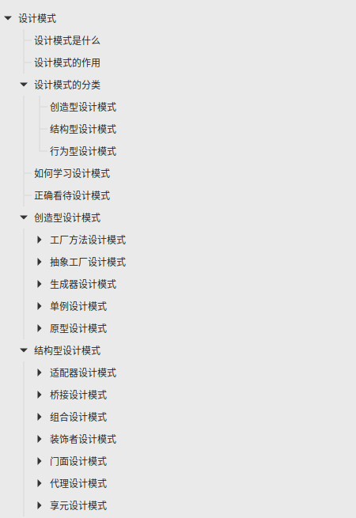
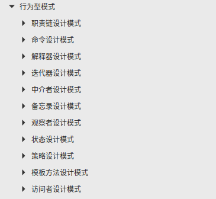

# Waking-Up

> Most people overestimate what they can do in a day but underestimate what they can do in a year

</img>

This is a notebook I used to prepare for back-end development school recruitment interviews. According to different sections of basic computer knowledge, common questions and relatively standardized answers in interviews are recorded. Most of the questions have more detailed knowledge points. I use it to collect and organize some of the interview questions I have encountered and review them before the interview.

| &nbsp;&nbsp;&nbsp;Computer Network&nbsp;&nbsp;&nbsp; | &nbsp;&nbsp;&nbsp;Operating system&nbsp;&nbsp;&nbsp; | &nbsp;&nbsp;&nbsp;&nbsp;database&nbsp;&nbsp;&nbsp;&nbsp; | &nbsp;&nbsp;&nbsp;Design Patterns&nbsp;&nbsp;&nbsp; | &nbsp;&nbsp;&nbsp;&nbsp;&nbsp;tool&nbsp;&nbsp;&nbsp;&nbsp;&nbsp; | &nbsp;&nbsp;&nbsp;&nbsp;Python&nbsp;&nbsp;&nbsp;&nbsp; |    &nbsp;&nbsp;&nbsp;&nbsp;&nbsp; Facial Sutra&nbsp;&nbsp;&nbsp;&nbsp;&nbsp;    |
| :----------------------------------------: | :--------------------------------------------------: | :-------------------------------------------------------------: | :--------------------------------------------------: | :-----------------------------------------------------------------------: | :-------------------------------------------------------------: | :--------: 
|          [:cloud:](#1-Computer Networking)           |               [:computer:](#2-Operating System)               |                   [:floppy_disk:](#3-Database)                    |                 [:art:](#4-Design Patterns)                  |                            [:wrench:](#5-Tools)                            |                      [:snake:](#6-python)                       | [:memo:](#7-Facial Sutra) |

### how to use?

This note is not in the form of explaining every knowledge point. Its purpose is very pure, which is to quickly prepare for the interview test points, so it all uses [common interview questions + follow-up questions + answers that can be used directly] form, and strive to achieve the purpose of efficient war preparation.

You can use it as a source of questions for **mock interviews** to test your proficiency; you can also use it as a **knowledge point review** before the interview to fill in some detailed questions;

Of course, this notebook is also suitable for those who can pass the resume screening, but know little about computer basics. If you have never taken these courses in school before or taught yourself these courses, you can still use this notebook to quickly** Prepare for interviews**.

When you browse the table of contents of each section, you may feel that not many questions are involved, but in fact, the **a series of follow-up questions under each question** is the essence of these notes. If you feel you already know the questions in the table of contents, you can click on those questions to read more of their follow-up questions.

This repo does not include the data structure and algorithm parts. You can check out my other repo: [Solid data structure and algorithms](https://github.com/wolverinn/Iridescent). In this repo, I systematically practiced each data structures and algorithms, and provides Python code

### Contribute

This warehouse is still under continuous improvement. Some questions have not been added to the notes. The ideas and answers to some questions can be better! If you have great ideas, please feel free to submit issues or pull requests!

Thank you to all the partners who participated in this project (if you are missed below, please remind me) ~

Contributers:

 
 
 
 
 
 
 
 
 
 
 
 
 
 
 
 
 
 

## 1. [computer network](Computer%20Network.md)

<a href="Computer%20Network.md" target="_blank"></img></a>

## 2. [operating system](Operating%20Systems.md)

<a href="Operating%20Systems.md" target="_blank"></img></a>

## 3. [database](Database.md)

<a href="Database.md" target="_blank"></img></a>

## 4. [Design Patterns](Design%20Pattern.md)

Provided by @[lutherlau](https://github.com/lutherlau)

<a href="Design Pattern.md" target="_blank"></img> 
</img></a>

## 5. [tool](Git-ComdLine-REST.md)

<a href="Git-ComdLine-REST.md" target="_blank"></img></a>

## 6. [Python](Python%20Handbook.md)

<a href="Python%20Handbook.md" target="_blank"></img></a>

## 7. [Facial Sutra](https://www.nowcoder.com/discuss/359048)
The following is my interview experience and sharing of my experience preparing for the interview.
- [Three rounds of back-end development of Jiejingjing](https://www.nowcoder.com/discuss/359048)
- [ByteDance back-end face-to-face experience](https://mp.weixin.qq.com/s?__biz=MzU2OTk2Mzg3Mg==&mid=2247483685&idx=1&sn=933611d3dec4b4054cdbc33738261243&chksm=fcf7e52acb806c3c2390999e99a08e02ad51c484d5e47a9188fbcdb15e8693e11558915db842&token=1562114548&lang=zh_CN#rd)
- [ByteDance back-end face-to-face experience](https://mp.weixin.qq.com/s?__biz=MzU2OTk2Mzg3Mg==&mid=2247483707&idx=1&sn=605d5f502dff18d6c335fefc677c0c55&chksm=fcf7e534cb806c22588ced14f6040e907a08d0c815a7ea8ba0f4cd2be0ac2d7821c490104764&token=1562114548&lang=zh_CN#rd)

## Replenish:eyeglasses:：
-ByteDance internal recommendation (internship/social recruitment/school recruitment)），Please poke[:raising_hand::raising_hand:here:raising_hand::raising_hand:](https://github.com/wolverinn/Waking-Up/issues/16)
- Check out my latest projects：[technical learningRoadmap](https://github.com/wolverinn/Build-your-programming-skills)（Personal technical growth path after work）
- My official account：[Hardy的小屋](https://mp.weixin.qq.com/mp/appmsgalbum?action=getalbum&album_id=1807403091504250883)，Let’s talk about personal growth, welcome to pay attention

</img>

------
 
> The name of this notebook comes from the soundtrack "Waking Up" in the movie "Lone Survivor"; in the movie, this soundtrack appears in a scene where two team members are jogging on the prairie outside the base.

> A sentence I like very much in the movie:
> Anything in life worth doing is worth overdoing. Moderation is for cowards.

<a href="Python%20Handbook.md" target="_blank"></img></a>

