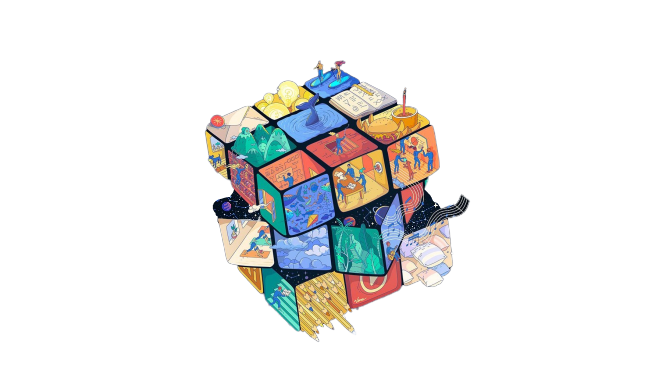
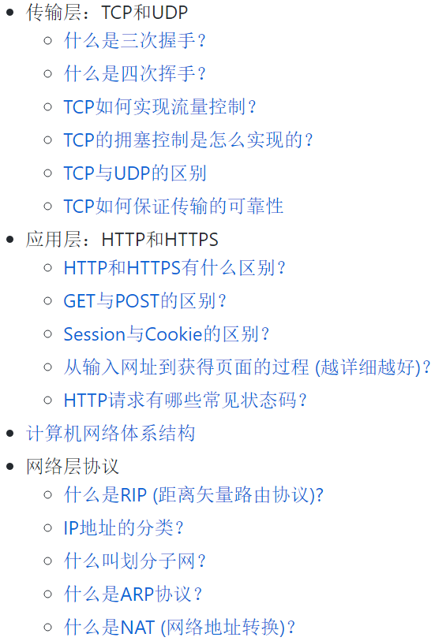
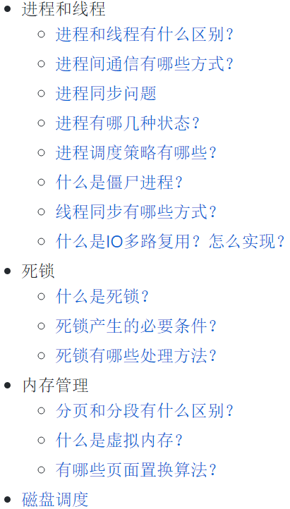
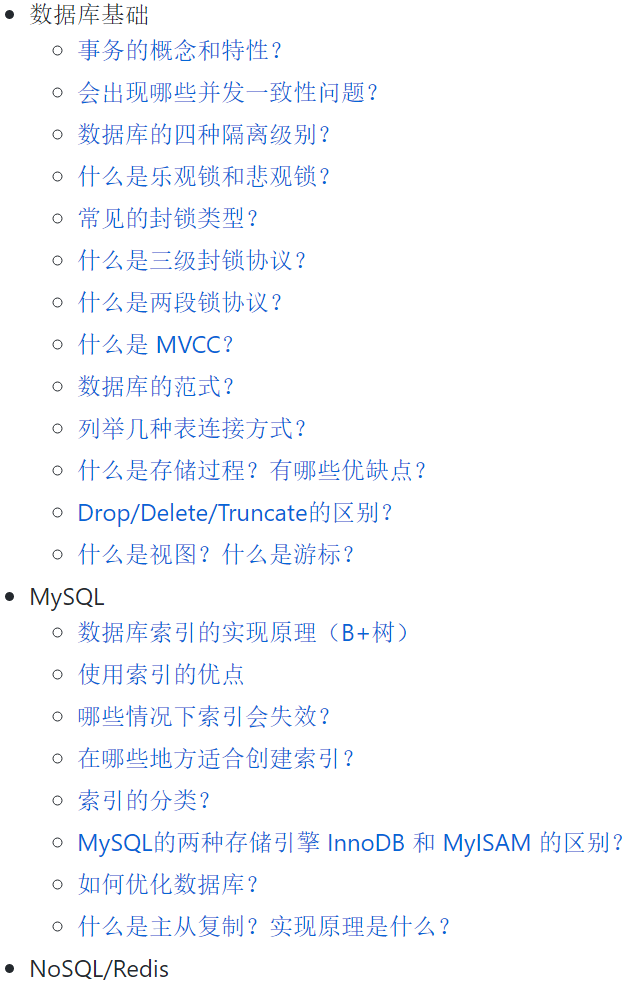
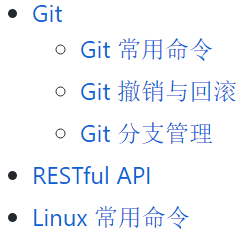
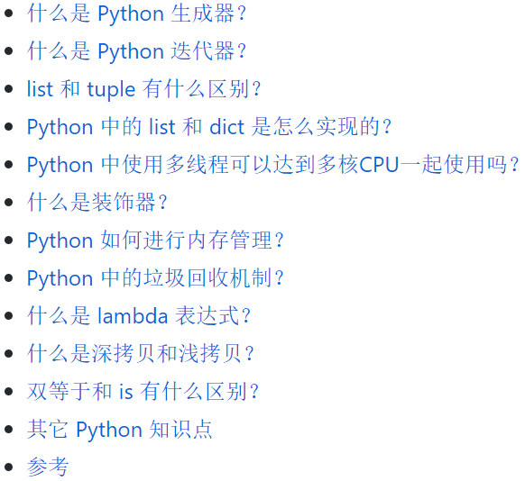
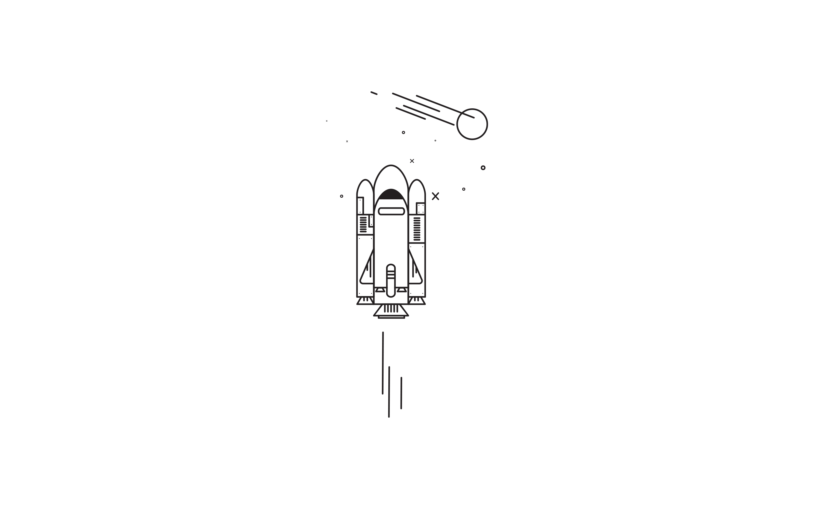

# Waking-Up

> 大多数人都高估了他们一天能做的事情，但低估了他们一年能做的事情

## 补充：字节跳动研发岗位内推！！！有效期至 2020-6-30 
我们部门现在大量招人，HC 100+，入职几率高，可**远程面试、入职**。这边是部门直推，不用走冗长的流程，HR**极速审核**，然后推给部门预约面试。之前投过字节不影响，可以捞起来再进行面试。  
【工作地点】北京/上海；  
【岗位】后端/前端/C++客户端/Android/iOS/算法/测试；**社招/实习/校招**均可，实习开放可转正实习/日常实习/暑期实习，社招开放初级/中级/高级各种级别  
【简历投递 - 社招/实习】社招/实习简历请发送至：zhangzekuan@bytedance.com；邮件标题：社招/实习+岗位+姓名。**所有邮件一天之内回复**，我可以帮忙查进度以及修改简历，有任何岗位、简历进度、面试相关的问题都可以问我~  
【简历投递 - 校招】校招通过内推码: YZGYZWU 在[校招官网](https://job.toutiao.com/campus/)自助投递，内推将获得简历优先筛选机会～后端请戳[:raising_hand::raising_hand:](https://job.toutiao.com/s/tBe2Vr)

</img>

这是我用来准备后端开发校招面试的一个笔记本。按照计算机基础知识的不同版块，记录了面试中常见的问题以及比较规范的答案，大部分问题都带有更加细节的知识点追问。我用它来收集整理自己遇到的一些面试题，并且在面试前回顾。

| &nbsp;&nbsp;&nbsp;&nbsp;计算机网络&nbsp;&nbsp;&nbsp;&nbsp; | &nbsp;&nbsp;&nbsp;&nbsp;&nbsp;操作系统&nbsp;&nbsp;&nbsp;&nbsp;&nbsp; | &nbsp;&nbsp;&nbsp;&nbsp;&nbsp;数据库&nbsp;&nbsp;&nbsp;&nbsp;&nbsp; | &nbsp;&nbsp;&nbsp;&nbsp;设计模式&nbsp;&nbsp;&nbsp;&nbsp; | &nbsp;&nbsp;&nbsp;&nbsp;&nbsp;&nbsp;工具&nbsp;&nbsp;&nbsp;&nbsp;&nbsp;&nbsp; | &nbsp;&nbsp;&nbsp;&nbsp;&nbsp;Python&nbsp;&nbsp;&nbsp;&nbsp;&nbsp; |    &nbsp;&nbsp;&nbsp;&nbsp;&nbsp;面经&nbsp;&nbsp;&nbsp;&nbsp;&nbsp;    |
| :----------------------------------------: | :--------------------------------------------------: | :-------------------------------------------------------------: | :--------------------------------------------------: | :-----------------------------------------------------------------------: | :-------------------------------------------------------------: | :--------: |
|          [:cloud:](#1-计算机网络)           |               [:computer:](#2-操作系统)               |                   [:floppy_disk:](#3-数据库)                    |                 [:art:](#4-设计模式)                  |                            [:wrench:](#5-工具)                            |                      [:snake:](#6-python)                       | [:memo:](https://www.nowcoder.com/discuss/359048) |

### 如何使用？

这份笔记采用的并不是对每一个知识点进行讲解的形式，它的目的很纯粹，就是为了快速备战面试考点，因此全都是采用【常见面试问题 + follow-up questions + 可以直接采用的答案】的形式，力求达到效率备战的目的。

你可以将其作为**模拟面试**的问题来源，测试你的熟练程度；也可以当作面试前的**知识点梳理**，对一些细节问题进行填补；

当然，这个笔记本也同样适用于那些能够通过简历筛选，但是对计算机基础所知甚少的人，如果你之前从未在学校修过或者自学过这些课程，你依然可以通过这份笔记**快速备战面试**。

当你浏览每个版块的目录时，你可能会觉得并没有涉及到多少问题，但其实，**每个问题下的一连串追问**才是这些笔记的精华所在。如果你觉得你已经对目录中的问题了然于胸，你可以点进这些问题，多看看它们的 follow-up questions.

这个repo没有包含数据结构与算法部分，你可以查看我的另一个repo：[Solid data structure and algorithms](https://github.com/wolverinn/Iridescent)，在这个repo中我系统地练习了各种数据结构和算法，并提供了Python代码

### Contribute

这个仓库目前还在不断完善之中，有些问题还没加入到笔记，有些问题的思路和答案可以做得更好！如果你有很棒的想法，欢迎提 issues 或者 pull requests！

Contributers: 

 
 

## 1. [计算机网络](Computer%20Network.md)

<a href="Computer%20Network.md" target="_blank"></img></a>

## 2. [操作系统](Operating%20Systems.md)

<a href="Operating%20Systems.md" target="_blank"></img></a>

## 3. [数据库](Database.md)

<a href="Database.md" target="_blank"></img></a>

## 4. [设计模式](Design%20Pattern.md)

（待整理）

## 5. [工具](Git-ComdLine-REST.md)

<a href="Git-ComdLine-REST.md" target="_blank"></img></a>

## 6. [Python](Python%20Handbook.md)

<a href="Python%20Handbook.md" target="_blank"></img></a>

</img>

------
 
> 这个笔记本的名字来源于电影《Lone Survivor》中的配乐《Waking Up》；在电影中，这段配乐出现的场景，是两名队员在基地外面的大草原上晨跑。

> 电影中我很喜欢的一句话：  
> Anything in life worth doing is worth overdoing. Moderation is for cowards.

